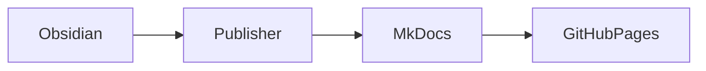
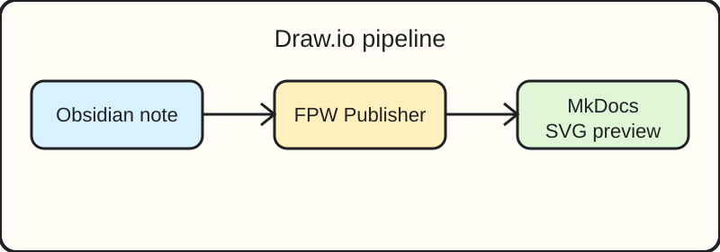
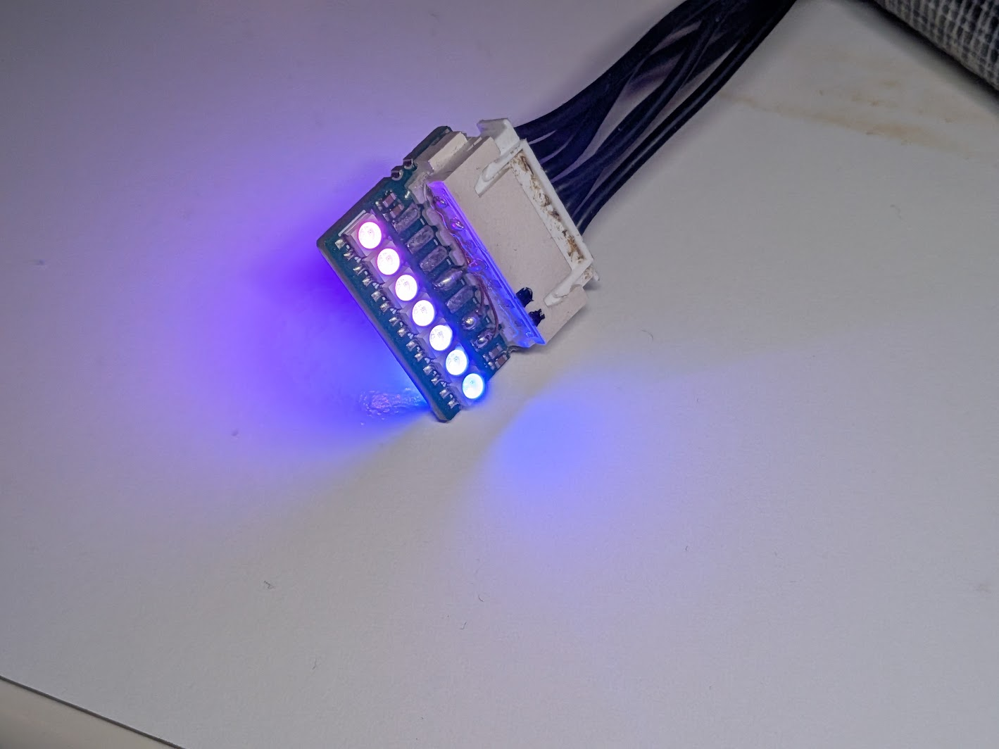

# Public Overview

This page should be exported to the MkDocs test repository.

- Deep page: [01 Foundations/Deep/Nested Page](Deep/Nested Page.md)
- Private page that should remain unresolved: Private/Should Not Export
- Published exception: [Private/Published Exception/Visible Private Test](../Private/Published Exception/Visible Private Test.md)
- Deeper navigation check: [01 Foundations/Deep/Level 3 Page](Deep/Level 3 Page.md)

!!! note "Obsidian-to-MkDocs feature fixture"
    Material for MkDocs renders this callout as a highlighted note while the source remains ordinary Markdown.

| Feature | Expected result |
| --- | --- |
| Mermaid | Rendered diagram |
| Image embed | Copied into `docs/assets/media` |
| Nested page | Reflected in `mkdocs.yml` |

```typescript
const publishing = "frontmatter-driven";
console.log(publishing);
```

- [x] Exported through the sandbox preview
- [x] Checked in the local browser
- [ ] Publish to GitHub Pages

## Mermaid graph



## Excalidraw


## Draw.io

{ style="max-height: 28rem; max-width: 100%; object-fit: contain;" }
[Open Draw.io source](../../assets/drawio/Obsidian to MKDocs Testing Sandbox/assets/engineering-diagram.drawio)

## Image fixture

{ style="max-height: 28rem; max-width: 100%; object-fit: contain;" }

## Video fixture

<video controls width="640" src="https://interactive-examples.mdn.mozilla.net/media/cc0-videos/flower.mp4"></video>

## Audio fixture

<audio controls src="https://interactive-examples.mdn.mozilla.net/media/cc0-audio/t-rex-roar.mp3"></audio>

External reference: [MkDocs](https://www.mkdocs.org/)
