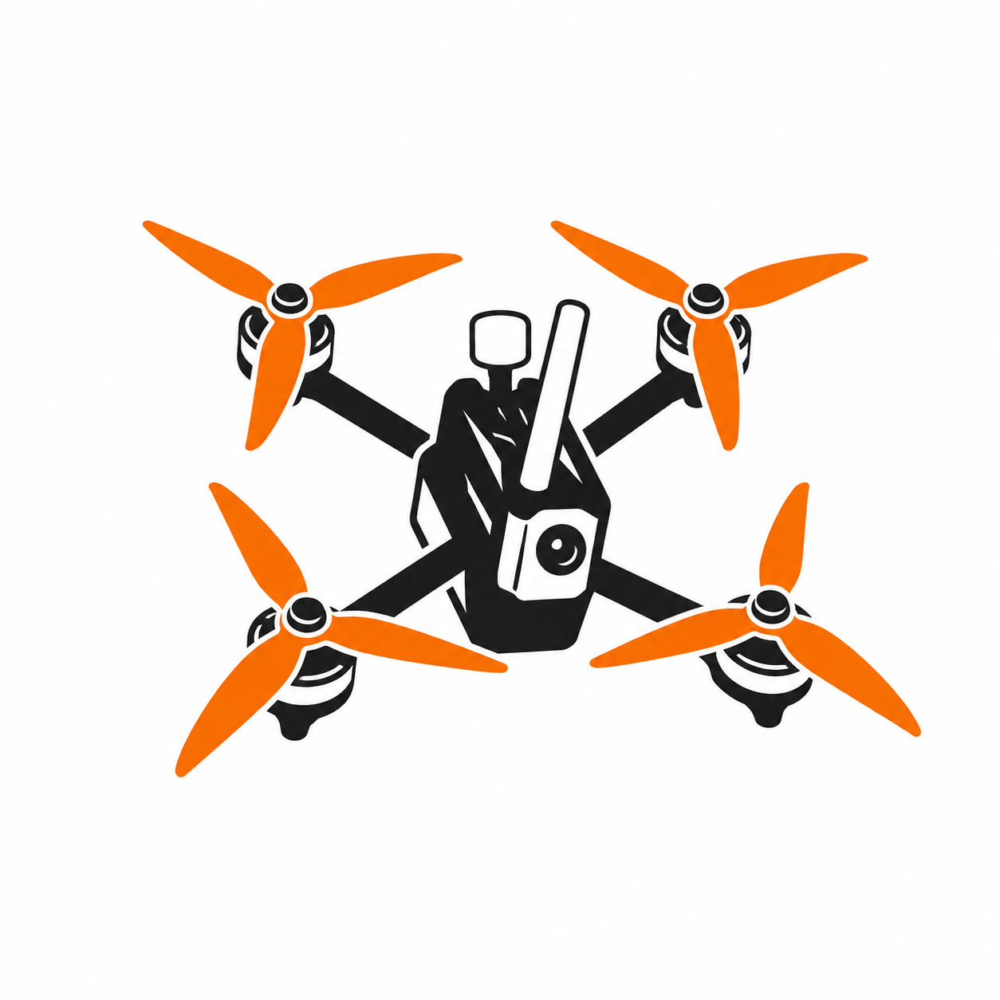

---
hide:
  - navigation
  - toc
---

<section class="hero">
  

    FPV · RACING · BUILDING
    <h1>FPV racing. Builds & repairs.</h1>
    
My place for race reports, builds, repairs and everything I learn about FPV along the way.

    

      <a class="md-button md-button--primary" href="articles/">Read articles</a>
      <a class="md-button" href="wiki/">Explore the wiki</a>
    

  

  

    
  

</section>

  EXPLORE
  <h2>Everything FPV in one place</h2>

<a class="feature-card feature-card--articles" href="articles/">
  01
  <h3>Articles & stories</h3>
  
Race weekends, new builds, lessons learned and personal thoughts from the FPV world.

  Read the articles →
</a>

<a class="feature-card feature-card--wiki" href="wiki/">
  02
  <h3>FPV wiki</h3>
  
Practical reference material on components, setup, Betaflight, repairs and troubleshooting.

  Browse the wiki →
</a>

<a class="feature-card feature-card--builds" href="builds/">
  03
  <h3>Quad builds</h3>
  
Complete component lists, build notes, setup decisions and lessons from the workbench.

  Explore my builds →
</a>

<a class="feature-card feature-card--profile" href="about-me/">
  04
  <h3>Pilot & rankings</h3>
  
Who I am, what I fly and how I perform on the race track.

  View my profile →
</a>

  
„Build. Fly. Crash. Repair. Repeat.“

  — the natural FPV cycle

