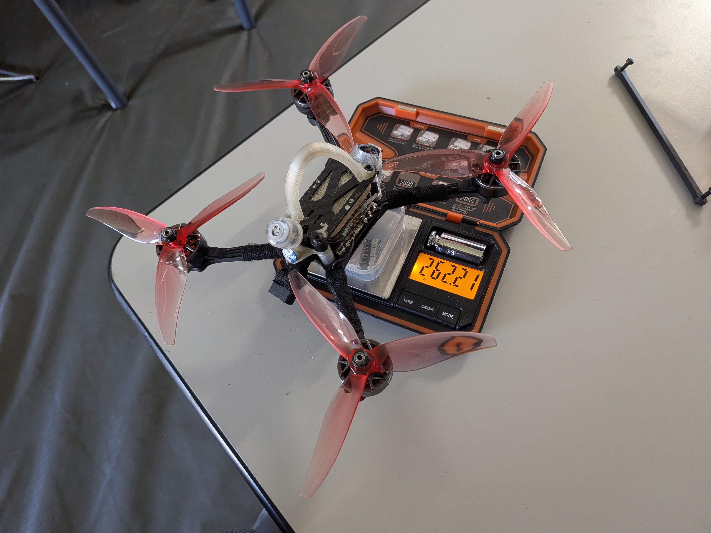
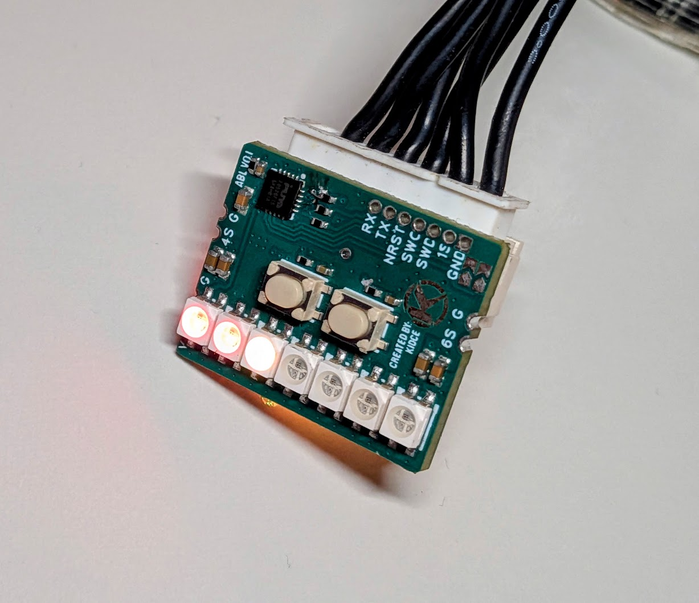

---
hide:
  - navigation
  - toc
---

<section class="hero">
  

    FPV · RACING · BUILDING
    <h1>FPV racing. Builds & repairs.</h1>
    
Race builds, practical fixes, open-source projects and browser tools from my FPV workbench.

    

      <a class="md-button md-button--primary" href="builds/">Browse the builds</a>
      <a class="md-button" href="wiki/">Start with the wiki</a>
    

  

  

    
  

</section>

<section class="home-overview">
  

    START HERE
    <h2>A growing FPV workshop</h2>
    
The site is still compact, but the useful parts are already here: real build notes, practical wiki pages, hardware projects, race data and tools that can be opened directly in the browser.

  

  

    
<strong>4</strong>build pages

    
<strong>4</strong>web tools

    
<strong>FPV</strong>wiki & repairs

    
<strong>DATA</strong>race archive

  

</section>

  EXPLORE
  <h2>Everything that is already here</h2>
  
Choose a starting point based on what you want to do: build a quad, solve a problem, explore a project or use a tool.

<article class="feature-card feature-card--builds">
  01
  <h3><a class="feature-card__title" href="builds/">Build bench</a></h3>
  
Concrete quad documentation, from an affordable 5-inch build to the current HDZero racing setup.

  <ul class="feature-card__list">
    <li>Budget, racing, DJI O4 and analog builds</li>
    <li>Parts, weight comparisons and setup notes</li>
  </ul>
  <a class="feature-card__link" href="builds/">Open the build logs →</a>
</article>

<article class="feature-card feature-card--wiki">
  02
  <h3><a class="feature-card__title" href="wiki/">Practical FPV wiki</a></h3>
  
Short reference pages for the things that matter at the bench, in the field and during repairs.

  <ul class="feature-card__list">
    <li>ESC capacitors, gate padding and daily notes</li>
    <li>Receiver troubleshooting from the workbench</li>
  </ul>
  <a class="feature-card__link" href="wiki/">Browse the wiki →</a>
</article>

<article class="feature-card feature-card--projects">
  03
  <h3><a class="feature-card__title" href="projects/">Projects &amp; hardware</a></h3>
  
Longer-running projects that go beyond one quad, including electronics, endurance experiments and printer research.

  <ul class="feature-card__list">
    <li>Addressable Balancer LEDs and 3.5-inch 1S drone</li>
    <li>Flashforge Creator 5 knowledge base</li>
  </ul>
  <a class="feature-card__link" href="projects/">Explore the projects →</a>
</article>

<article class="feature-card feature-card--tools">
  04
  <h3><a class="feature-card__title" href="Web%20Tools/">Tools for pilots</a></h3>
  
Small browser and radio utilities for checking a flight controller, building firmware or managing rates.

  <ul class="feature-card__list">
    <li>RX Monitor, KAACK Cloud Build and Configurator</li>
    <li>RatesManager for EdgeTX radios</li>
  </ul>
  <a class="feature-card__link" href="Web%20Tools/">Open the web tools →</a>
</article>

<section class="home-latest">
  

    THE ARTICLE SECTION STARTS HERE
    <h2>A new home for my FPV notes</h2>
    
The articles area begins with a short welcome note: what belongs in a story, what belongs in the wiki and why this site is being built as a practical record of the hobby.

    <a class="feature-card__link" href="articles/2026/07/14/a-new-home-for-my-fpv-notes/">Read the welcome note →</a>
  

  

    ON THE TRACK
    <strong>Race archive</strong>
    
Verified event results, season trends and the Holy*s*quad squad overview are collected in one place.

    <a class="feature-card__link" href="race-results/">Open the race archive →</a>
  

</section>

<section class="home-gallery">
  

    FROM THE WORKBENCH
    <h2>Real projects, real hardware</h2>
    
A quick visual introduction to the kind of work documented here.

  

  

    <figure class="home-gallery__item">
      
      <figcaption><strong>2026 Racing Setup</strong> A 5-inch race quad, with weight and motor choices documented in the build notes.</figcaption>
    </figure>

    <figure class="home-gallery__item">
      
      <figcaption><strong>Addressable Balancer LEDs</strong> A compact electronics project for FPV lighting and battery-status indication.</figcaption>
    </figure>

    <figure class="home-gallery__item">
      
      <figcaption><strong>Flashforge Creator 5</strong> Evidence-based hardware and recovery notes from a parallel engineering project.</figcaption>
    </figure>
  

</section>

  
„Build. Fly. Crash. Repair. Repeat.“

  — the natural FPV cycle

