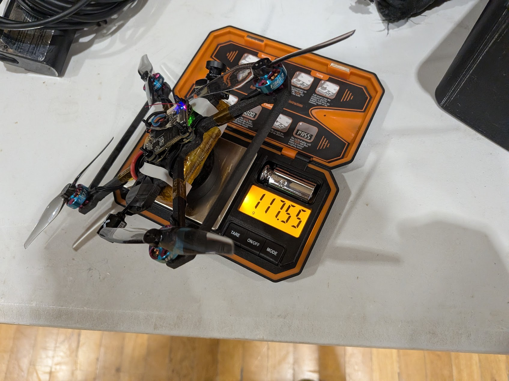
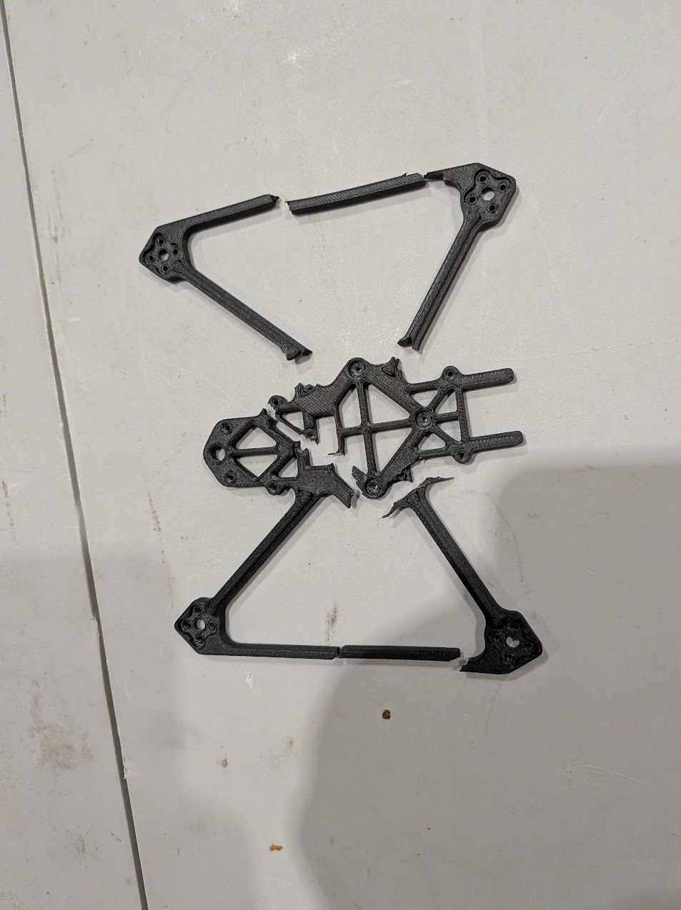
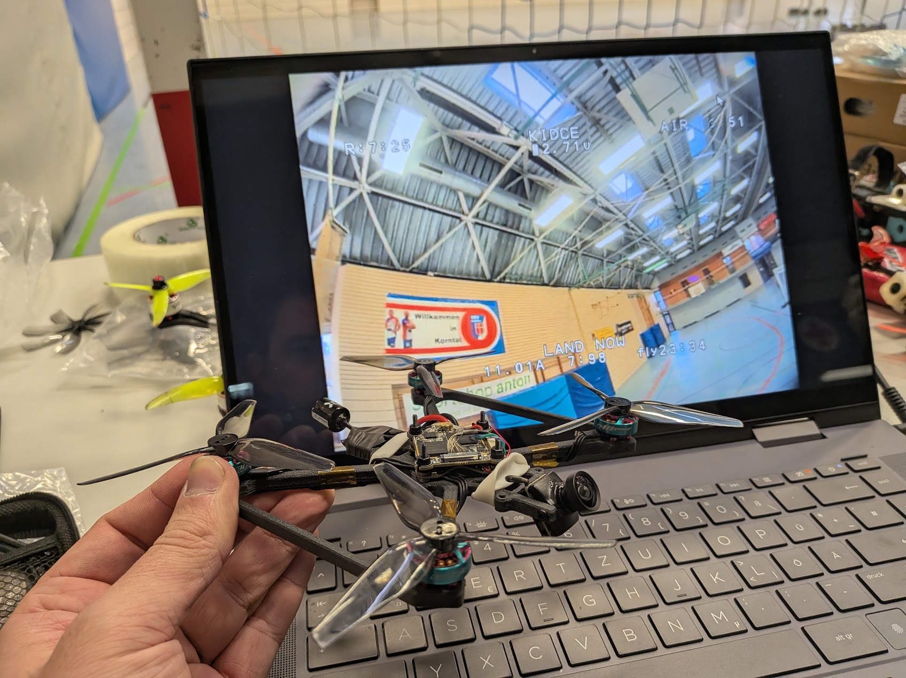

# 3.5" 1S Endurance Drone

An experimental 3.5-inch drone optimized for long flight times on a single-cell battery. Its lightweight frame is 3D-printed from PPA-CF.

## Design and priorities

The frame was designed around low weight, long flight time and a low part count. The camera mount is integrated directly into the frame, avoiding a separate bracket and keeping the build simple.

This is an endurance platform, not a crash frame. The camera is relatively exposed and may be damaged in a crash; that is an intentional trade-off for weight and simplicity. The frame currently weighs about **17 g** and the PPA-CF print has made a very good first impression in stiffness and vibration behaviour.

- Maximize endurance with a 1S power system
- Develop a lightweight, printable PPA-CF frame
- Find an efficient combination of motors, propellers and electronics
- Document flight time, weight and durability

## Current configuration

| Component | Current setup |
| --- | --- |
| Frame | Custom 3D-printed PPA-CF frame, approximately 17 g |
| Motors | RCinPower 1303, 11,500 KV |
| Propellers | HQProp 3.5-inch D-Blade for testing; tri-blade also works but feels less efficient and slightly less responsive |
| Flight controller / ESC board | BetaFPV Matrix 4-in-1 board; exact model designation to be confirmed |
| Video transmitter | Older HDZero Whoop VTX |
| Battery | Molicel P45B |

## Flight and antenna notes

The antenna is currently taped to the frame as a temporary solution. A clean mount that keeps it farther away from the frame is still missing. The next frame revision should improve antenna placement for better range and protection, while also providing a cleaner solution for the receiver/radio-link connection.

The current video setup uses an older HDZero Whoop VTX. A future revision is planned with a DJI O4 Lite, but the frame should be adapted first to support proper antenna placement.

## Current test results

The first measurements already show the direction of the project:

- **117.55 g take-off weight** with a Molicel P45B installed.
- **24 minutes of flight time** achieved during an indoor endurance test with a Molicel P45B.
- **Intentional frame destruction test** performed to develop a practical feel for the printed frame's strength and stiffness. This is an informal destructive test, not a standardized material test.

  <figure>
    
    <figcaption><strong>117.55 g take-off weight</strong> The complete 3.5-inch 1S endurance drone weighed with a Molicel P45B installed.</figcaption>
  </figure>

  <figure>
    
    <figcaption><strong>Intentional frame destruction</strong> The frame after a deliberate break test to get a practical sense of its strength and stiffness.</figcaption>
  </figure>

  <figure>
    
    <figcaption><strong>24-minute indoor endurance test</strong> Indoor flight test with a Molicel P45B reaching the reported 24-minute mark.</figcaption>
  </figure>

!!! note "More data to follow"
    The component list, frame files, print settings and additional test results will be added during development.
