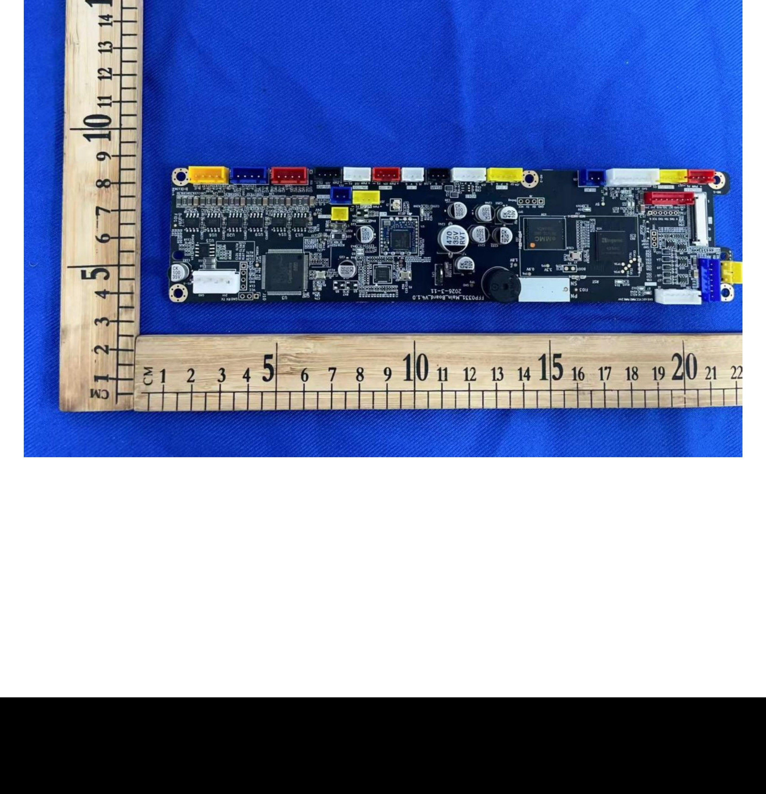
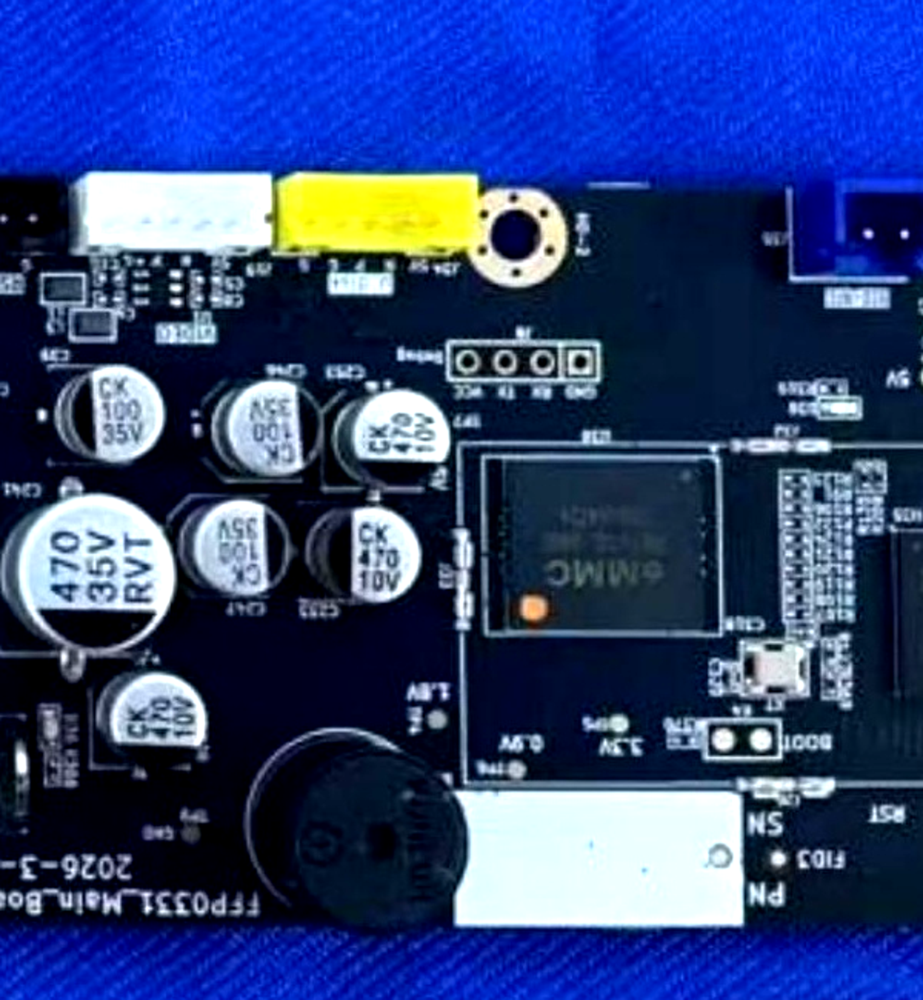

## For future Claude

This note is the single source of truth for measured Creator 5 Pro recovery evidence recorded on 2026-08-26 and 2026-08-27. It describes one physically tested unit and separates physical confirmation, static inspection, repository evidence, and inference. Do not apply its geometry or hashes to another printer without a fresh read-only inventory.

## Device under test

| Item | Observed value | Evidence |
| --- | --- | --- |
| Printer | Flashforge Creator 5 Pro | P1 |
| Stock firmware before incident | 1.9.8 | P1/S1 |
| Linux | Buildroot 2020.02.1, Linux 5.10.186+, MIPS | S1 |
| SoC family | X2600 from BootROM; X2600H Stage-2 label | P1 |
| eMMC marking | PSE6A0SL-08GE | P1 |
| BootROM USB | VID A108, PID EAEF | P1 |
| Mainboard marking in FCC image | FFP0331_MainBoard_V1.0, date 2026-3-11 | C1/S1 image evidence |

The Stage-2 label does not prove the exact silicon suffix or compatibility with another board revision.

## Physical interfaces

- Bridging K4/BOOT at power-on selected an Ingenic USB BootROM mode.
- The unpopulated J29 pads exposed the tested USB data pair and ground.
- The Debug header showed no observed UART transitions on the tested pads with a 3.3 V adapter and oscilloscope. This does not prove every possible UART route is inactive.

Images:

- { style="max-height: 28rem; max-width: 100%; object-fit: contain;" }
- { style="max-height: 28rem; max-width: 100%; object-fit: contain;" }

FCC source: https://fccid.io/2AKLL-C5P/Internal-Photos/Internal-Photos-9540928

## MMC0 user-area readback

The complete read-only MMC0 user area measured 7,837,581,312 bytes, or 15,307,776 sectors of 512 bytes. The SHA-256 is:

~~~text
373EA4DA6CB579978FF49F592E4F025BFA6CFEA523AAC092D5D3F2ED4A79A087
~~~

The last readable sector start was 0x1D327FE00 and the first invalid sector start was 0x1D3280000. The GPT-visible layout was smaller than the measured physical user area; the extra tail was readable and zero-filled in this observation.

Separate regions:

- boot0 and boot1 were later acquired through recovered Linux on 2026-08-27; each was 4 MiB, byte-identical, zero-filled, with SHA-256 BB9F8DF61474D25E71FA00722318CD387396CA1736605E1248821CC0DE3D3AF8.
- RPMB was not acquired as a raw image.
- Therefore the readback is an MMC0 user-area image, not an entire eMMC image.

## GPT-visible partition layout

| Index | Name | Start offset | Size | Runtime mount |
| ---: | --- | ---: | ---: | --- |
| 1 | kernel | 0x00100000 | 8 MiB | none |
| 2 | rootfs | 0x00900000 | 100 MiB | /, SquashFS |
| 3 | kernel2 | 0x06D00000 | 8 MiB | alternate slot |
| 4 | rootfs2 | 0x07500000 | 100 MiB | alternate slot |
| 5 | ota | 0x0D900000 | 1 MiB | update state |
| 6 | usershare | 0x0DA00000 | 1,024 MiB | /usr/prog and bind-mounted /etc |
| 7 | userdata | 0x4DA00000 | 5,828 MiB | /usr/data |

The primary GPT described 7,356 MiB and pointed to a backup GPT that was not present at the reported final sector. Treat that inconsistency as a warning.

## Confirmed boot failure

The factory-rootfs init path contains:

~~~sh
if [ -f "/usr/prog/app_startup.sh" ]; then
    /usr/prog/app_startup.sh
fi
~~~

In the acquired partition 6, the bricked app_startup.sh was mode 600 and root:root. The device-local pre-change backup was mode 755 and root:root. The only content difference was the inserted loop-launcher line. This explains the frozen logo, absent network/touch, and ineffective Linux-path USB recovery for that incident.

The exact file sizes and SHA-256 values are preserved in the local source evidence at docs\c5p-deep-unbrick\EVIDENCE.md and the prepared repair files. This note owns the device-specific facts; other notes must link here.

## Prepared repair status

A repaired partition 6 image was prepared offline, passed a non-modifying ext4 check, and differed from the source only in the intended startup file and filesystem metadata. It was not written to the printer in the recorded evidence.

## Evidence classification

- P1: K4/J29 enumeration, Stage 2, read-only acquisition, file modes, and temporary ADB access.
- S1: GPT, partition mounts, rootfs init, firmware structure, and ELF properties.
- C1: FCC identification and community feature claims.
- I1: A clean A/B target architecture may be possible, but bootloader slot behavior is not yet demonstrated.

## Source pointers

- [Projects/3D Printing/Flashforge Creator 5/Knowledge Base/Sources/Deep Unbrick/EVIDENCE](../Sources/Deep Unbrick/EVIDENCE.md)
- [Projects/3D Printing/Flashforge Creator 5/Knowledge Base/Sources/Deep Unbrick/EMMC-REGION-BUNDLE](../Sources/Deep Unbrick/EMMC-REGION-BUNDLE.md)
- Local archive path: docs\c5p-deep-unbrick\EVIDENCE.md
