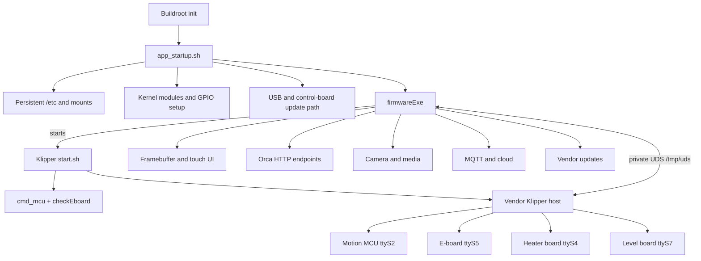
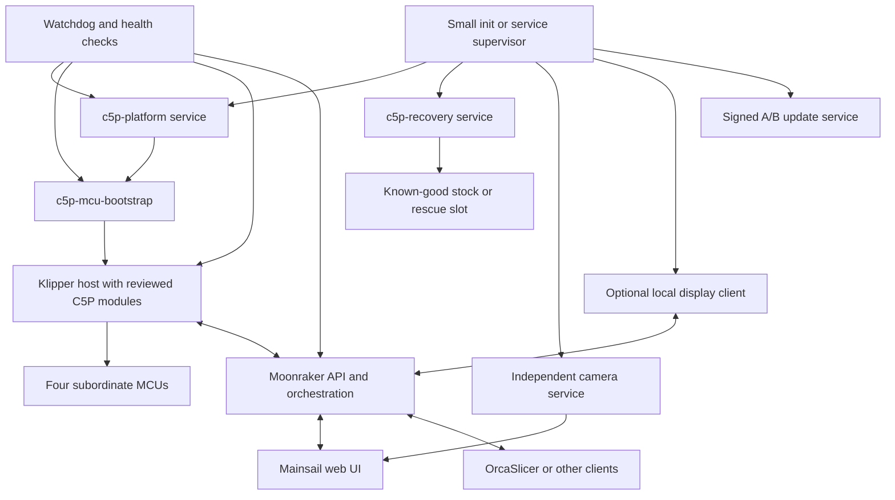

## For future Claude

This research note evaluates replacing the Flashforge Creator 5 Pro vendor control stack with a clean, debuggable Linux, Klipper, Moonraker, and Mainsail architecture. It combines physical findings from one recovered printer, offline analysis of firmware 1.9.8, repository evidence, and upstream primary documentation checked on 2026-08-27. The staged migration plan is actionable, but stock-free heating, motion, printing, and a replacement image have not yet been validated on physical hardware.

# Creator 5 Pro: Feasibility of an Open, Clean Firmware Stack

> [!summary] Executive conclusion
> A largely open Creator 5 Pro platform controlled natively through Klipper, Moonraker, and Mainsail is technically realistic. The sensible route is not to replace the kernel, bootloader, and every Flashforge component at once. The first target should be a reversible, `firmwareExe`-free control path on the known vendor kernel. The vendor Klipper changes can then be ported, followed by the root filesystem, kernel, and boot chain.

> [!warning] Safety status
> This report is a feasibility and research foundation. It does not confirm safe operation without `firmwareExe`. Heaters, axes, tool changes, MCU firmware updates, and fault shutdown must each be validated on real hardware. Until then, all replacement experiments must keep heater and motor enables disabled.

## 1. Target outcome

The desired result is not another patch layered onto the existing Flashforge system. It is a traceable platform with clear ownership boundaries:

- a reproducible Linux image instead of a manually modified system partition;
- separately supervised services instead of one central `app_startup.sh`;
- Klipper as the sole printer-control authority;
- Moonraker as the documented API and integration layer;
- Mainsail as the primary web interface;
- Klipper macros for print workflows and operator-level behavior;
- small Klipper modules only where macros are insufficient;
- separate Linux services for pre-Klipper duties such as MCU bootstrap, networking, camera, and updates;
- explicit logs, health checks, restart rules, and dependencies;
- safe recovery with a stock fallback before any permanent replacement;
- no mandatory Flashforge cloud or undocumented telemetry;
- no closed component in the safety-critical print path wherever technically and legally achievable.

## 2. Evidence legend

| Label | Meaning |
| --- | --- |
| **P1 - physically confirmed** | Measured or successfully executed on one Creator 5 Pro. |
| **S1 - statically confirmed** | Directly supported by the read-only image, scripts, configurations, ELF metadata, or symbols. |
| **R1 - repository source** | Supported by a linked repository at a recorded revision, but not necessarily tested on this printer. |
| **U1 - upstream source** | Supported by official Klipper, Moonraker, Mainsail, or Linux build-system documentation. |
| **C1 - community report** | Taken from Discord or community documentation and not independently confirmed. |
| **I1 - inference** | Technical conclusion derived from evidence; requires a confirming test. |
| **TBD** | Unknown or not investigated sufficiently. |

## 3. Most important existing findings

### 3.1 Recovery and offline laboratory

The largest achievement so far is that firmware research no longer has to take place only on the sole physical printer.

- **P1:** Bridging K4/`BOOT` at power-on places the X2600 in Ingenic BootROM/USBCloner mode.
- **P1:** J29 exposes the working USB data connection.
- **P1:** A complete read-only readback of the normal MMC0 user area was acquired: `7,837,581,312` bytes, SHA-256 `373EA4DA6CB579978FF49F592E4F025BFA6CFEA523AAC092D5D3F2ED4A79A087`.
- **P1:** `boot0`, `boot1`, and RPMB are not included in that image.
- **P1:** Temporary unauthenticated root ADB access through J29 was confirmed after a normal Linux boot. It disappears after reboot and must never be enabled automatically without an explicit physical opt-in.
- **S1:** The image contains two kernel and two rootfs partitions, plus separate `usershare` and `userdata` partitions.
- **S1:** The partition layout could support A/B updates. The bootloader's actual slot-selection and rollback behavior still has to be demonstrated before either slot is repurposed.

This foundation enables controlled offline diffs, reproducible patches, symbol-assisted analysis, and rollback artifacts. Personal raw images must not be published because they may contain keys, device identifiers, logs, and copyrighted vendor files.

### 3.2 Operating system and startup chain

- **P1/S1:** The inspected printer uses Buildroot 2020.02.1, Linux 5.10.186+, and MIPS on an Ingenic X2600-family SoC.
- **S1:** The rootfs is SquashFS. Persistent vendor programs are stored on `usershare` under `/usr/prog`; user data and configuration are stored under `/usr/data`.
- **S1:** `/usr/prog/etc` is mounted over `/etc`. Changes that appear to be ordinary `/etc` changes therefore do not behave like changes on a conventional Linux distribution.
- **S1:** The rootfs init path only checks whether `/usr/prog/app_startup.sh` exists and then executes it directly.
- **P1/S1:** Accidentally changing `app_startup.sh` to mode `600` blocked the entire application startup. The result was a frozen logo, no network, no touch UI, and no normal USB update detection.

This confirms that `app_startup.sh` is currently a single point of failure. A clean target system must separate its responsibilities and make each service independently observable.

### 3.3 Responsibilities currently mixed into `app_startup.sh`

The firmware 1.9.8 script performs at least the following duties (**S1**):

1. Loads `soc_mcu.ko`, touch, and Wi-Fi kernel modules.
2. Creates and mounts the persistent `/etc`.
3. Searches for, extracts, and executes USB firmware or service packages.
4. Executes control-board updates and forces a reboot.
5. Stops DHCP and ADB processes.
6. Detects the touchscreen input device.
7. Sets numerous global library paths.
8. Starts a GPIO toggle script.
9. Starts `firmwareExe` and attempts a basic fallback copy if it exits.

This combination explains why a small shell error can make the entire printer unusable. It is also difficult to test because startup order, error handling, recovery, and application logic are coupled in one file.

Additional concrete technical debt (**S1**): `sys_start.sh` toggles `PC11` forever at one-second intervals without a documented purpose. The vendor update script copies and deletes files live under `/usr/prog`, directly replaces Klipper files and `firmwareExe`, and exposes no visible transactional rollback boundary in the inspected flow. Both behaviors should be explained before reimplementation and then replaced with declarative hardware initialization and atomic image updates.

### 3.4 `firmwareExe` is more than the local UI

The file extracted locally from the inspected 1.9.8 package has SHA-256 `09564BEFDB3C39B32DC05647656C9A4636C01BB60F9364D61FE5AABD1012CAB9`. It is a 32-bit little-endian MIPS32r2/o32 ELF executable. It is dynamically linked, not stripped, and contains DWARF debug information and named C++ symbols (**S1**).

The same-sized file in the public C5P firmware archive at revision `1f9d55e...` instead has SHA-256 `BF0599DC0B533FC7411464A1EA02222D42BBF2F7C4D5DD9B52AA0E5714128935` (**R1**, checked 2026-08-27). Filename and size are therefore not sufficient version identifiers. Every test and release path needs hashes for `firmwareExe`, host Klipper, configuration, MCU images, and board revision.

The local ELF requires libraries including `libssl.so.1.0.0`, `libcrypto.so.1.0.0`, OpenCV 4.2, FFmpeg, x264, and numerous other multimedia dependencies. It also contains an absolute build RPATH from a developer workspace (`/home/chenhe/work/...`) (**S1**). Even if the executable were functionally replaceable, its large and difficult-to-reproduce dependency surface is an additional reason not to retain it as the permanent system core.

Statically supported responsibilities include:

| Area | Evidence from file or symbols | Replacement direction |
| --- | --- | --- |
| Klipper startup | String `/usr/prog/klipper/start.sh &` | dedicated service with explicit dependencies |
| Klipper communication | `/tmp/uds`, `KlipperAPI::clientOpen`, `clientSend`, `clientRecv` | Moonraker plus Klipper API; trace the existing protocol |
| Print communication | `CommMgr::sendGcodeCmd`, `serialPrint`, `klipperOpen` | Klipper Virtual SD, G-code macros, Moonraker |
| Orca network API | `OrcaServer::request_upload_gcode`, `request_gcode_list`, `request_print_gcode` | Moonraker file and print APIs; point the slicer there directly |
| MCU handling | `bootSerialHeatMcu`, `bootSerialMainEboardMcu`, `bootSerialLevelBoardMcu` | separate, documented MCU bootstrap service |
| Firmware update | `UpdateManager`, `UpdateFirmware`, control directories | signed, versioned update service with rollback |
| Display and touch | `/dev/fb0`, `/dev/input/event*`, numerous LVGL widgets | Mainsail in a browser; optional local kiosk or lightweight local UI |
| Camera and media | camera directories, FFmpeg, OpenCV, x264 | dedicated camera service plus Moonraker webcam configuration |
| Cloud and telemetry | MQTT, HTTP, account, and cloud symbols | omit by default; isolate optional integrations |
| 3MF/G-code processing | `Parase3mfFile`, thumbnail and file functions | slicer, Moonraker metadata, and a documented import path |

> [!important]
> The binary cannot be removed safely until it is known which MCU bootstrap, update, G-code preprocessing, and fault-handling functions are mandatory for an operational printer. The fact that standard components can replace many UI and cloud functions does not prove complete hardware parity.

### 3.5 The existing Klipper is a vendor fork

The stock configuration uses four serial Klipper MCUs (**S1**):

| Function | Device | Baud rate |
| --- | --- | ---: |
| Extruder/E-board | `/dev/ttyS5` | 460800 |
| Main motion MCU | `/dev/ttyS2` | 230400 |
| Heater board | `/dev/ttyS4` | 230400 |
| Level board | `/dev/ttyS7` | 230400 |

The host fork contains Flashforge-specific or substantially modified modules and core paths (**S1**):

- `mclib.py` with custom MCU commands for motor current, stall detection, and resonance damping;
- `ff_eddy.py` with custom eddy, peel, and threshold commands;
- `pa_adjust.py` with `get_emcu_pa_value` and `pa_action`;
- `hd_home.py` and `e_stop.py` for vendor-specific home and stop workflows;
- an extended `stepper_resonance_tester.py`;
- modifications in `mcu.py`, `toolhead.py`, `homing.py`, `heaters.py`, `probe.py`, `virtual_sdcard.py`, and other upstream files;
- the additional `GET_MCU_VERSION` G-code command and a vendor-specific MCU-version handshake.

The stock configuration already includes many native Klipper building blocks: `virtual_sdcard`, `pause_resume`, `exclude_object`, `bed_mesh`, `input_shaper`, four extruder heaters, bed and chamber heaters, fans, door sensors, filament sensors, a probe, and macros. That is a major advantage. At the same time, settings such as `min_temp: -200` and unusually broad safety limits show that the existing files must not be adopted unchanged as a safe open configuration.

### 3.6 MCU bootstrap before Klipper

`/usr/prog/klipper/start.sh` performs the following steps before starting Klipper (**S1**):

```text
cmd_mcu write_firmware /usr/prog/libmcu-bare.bin
cmd_mcu bootup
sleep 2
checkEboard
klipperDaemon start
```

In addition, `firmwareExe` contains named functions for several serial MCU firmware paths. This supports the following conclusions:

- **I1:** At least some subordinate boards require a Flashforge-specific startup or firmware handshake before or alongside Klipper.
- **I1:** That work does not belong in a G-code macro because Klipper is not yet operational at that point.
- **TBD:** Whether `cmd_mcu`, `checkEboard`, and the `firmwareExe` MCU functions are redundant, complementary, or used only in specific update states.
- **TBD:** Which binary protocols and version rules are used on `/dev/ttyS4`, `/dev/ttyS5`, and `/dev/ttyS7`.

## 4. Current and target architectures

### 4.1 Simplified stock architecture



Text fallback: The rootfs init starts a central shell file. That file loads platform components and starts `firmwareExe`. The binary starts and controls the vendor Klipper host through a private Unix socket while also bundling the UI, network API, camera, cloud, and update functions.

### 4.2 Recommended target architecture



Text fallback: A small init or supervisor process starts separate platform, MCU, Klipper, Moonraker, camera, update, and recovery services. Each service has its own logs, readiness checks, and restart policy. Mainsail, slicers, and an optional local UI communicate through Moonraker instead of a proprietary binary.

## 5. What macros can and cannot replace

| Function | Klipper macro | Klipper module | Moonraker component | Linux service |
| --- | :---: | :---: | :---: | :---: |
| `PRINT_START`, `PRINT_END`, pause, resume, cancel | **yes** | rarely | UI/API | no |
| M106/M107 fan mapping and chamber logic | **yes** | optional | no | no |
| Tool selection, parking, purge, wipe | **yes**, if hardware commands exist | for additional state | optional | no |
| Gear lock/unlock sequence | probably | for custom MCU protocol | no | no |
| Filament-runout response | **yes** | sensor support required | notification | no |
| Adaptive mesh and object exclusion | **yes**, plus existing Klipper functions | only for custom data | file metadata | no |
| Eddy, PA, and MCLIB custom commands | no | **yes** | optional | no |
| Load subordinate MCU firmware and check versions | no | possibly in part | no | **yes** |
| Kernel modules, pinmux, power enable, mounts | no | no | no | **yes** |
| Print upload, file list, queue, and history | no | Virtual SD | **yes** | no |
| Slicer/Orca network API | no | no | **yes** or a thin adapter | no |
| Camera | no | no | configuration | **yes** |
| Local display | no | status source | API | **yes**, optional |
| System update, A/B slot, rollback | no | no | optional trigger | **yes** |
| Recovery ADB or USB rescue | no | no | no | **yes**, physical opt-in only |

The key design rule is that macros orchestrate printer functions that already exist. They do not replace pre-Klipper hardware initialization, kernel work, or unknown binary protocols.

Klipper also explicitly warns that a Jinja macro is fully evaluated before its generated G-code commands execute (**U1**, Klipper `Command_Templates.md`, revision `ac2a7f8...`, checked 2026-08-27). A macro must therefore not imitate a timing-critical feedback loop or safety monitor that would have to inspect state between generated commands. Such behavior belongs in a Klipper module, MCU firmware, or a narrowly scoped service.

## 6. A practical replacement plan for `firmwareExe`

### 6.1 Functions that standard components can replace

**High feasibility:**

- file upload, listing, selection, and G-code start through Moonraker;
- status, temperatures, axes, fans, and print progress through Klipper objects;
- Mainsail as the browser UI;
- pause, resume, cancel, filament change, start/end workflows, and chamber control through macros;
- object exclusion and adaptive mesh workflows;
- webcam service through a separate streamer;
- local and slicer-side operation without the Flashforge cloud;
- logs, configuration management, and update visibility through standard services.

### 6.2 Functions that still require research or porting

**Medium or unresolved feasibility:**

- initialization and firmware checks for all four MCU boards;
- tool magazine, extruder positions, locking, and safety interlocks;
- Flashforge-specific eddy, PA, home, E-stop, and MCLIB protocols;
- calibration data and storage formats;
- behavior after MCU restart, communication loss, or inconsistent versions;
- proprietary 3MF, thumbnail, and material metadata not covered by Orca or Mainsail;
- the local 800x480 touch experience if it must run directly on the printer.

### 6.3 Functions that can intentionally disappear

- mandatory Flashforge accounts and cloud services;
- vendor telemetry and MQTT connections;
- proprietary OTA logic without traceable rollback;
- internal video and cloud-slicing functions when local standard paths are sufficient;
- the Flashforge-specific UI if Mainsail and an optional local interface cover the required operator functions.

Feature parity should not mean reproducing every cloud and UI detail. The target is safe printer parity with better maintainability.

## 7. Recommended Linux service split

Even a minimal Buildroot system does not need a large general-purpose distribution. The critical property is separation of responsibilities.

| Service | Responsibility | Start condition | Health check | Failure response |
| --- | --- | --- | --- | --- |
| `c5p-mounts` | Data partitions and persistent paths | block devices present | expected read-write/read-only mount state | enter rescue mode |
| `c5p-platform` | Kernel modules, GPIO, touch, Wi-Fi | mounts ready | expected devices and modules present | do not start Klipper |
| `c5p-mcu-bootstrap` | MCU images, boot, version checks | UARTs present | every expected MCU responds | keep heaters and motors locked |
| `klipper` | Printer control | MCU bootstrap ready | API socket and `ready` state | controlled shutdown |
| `moonraker` | API, files, queue, history, integrations | Klipper socket present | `/server/info` and WebSocket | restart independently |
| `web-ui` | Mainsail assets and web server | Moonraker ready or degraded | HTTP response | restart independently |
| `camera` | MJPEG/WebRTC/frame capture | camera present | frame age and process state | restart without stopping a print |
| `local-ui` | optional touch UI | display and touch present | rendering and API connection | LAN Mainsail remains usable |
| `c5p-updater` | signed A/B updates | explicitly requested only | hash, signature, slot status | retain old slot |
| `c5p-recovery` | boot selection and physical rescue access | boot flag, USB action, or jumper | local recovery shell reachable | never grant normal print control |
| `watchdog` | overall state and safe shutdown | always | heartbeats plus hardware state | heaters off, optionally roll back |

Separate BusyBox or SysV init scripts may be sufficient for the first transition stage. A later image can use a small supervisor with declarative dependencies. The specific init system matters less than ensuring that no single shell script contains the entire platform's logic.

Moonraker's official documentation supports file management, G-code start, a FIFO queue, HTTP/WebSocket status, allow-listed system services, power components, and software-update information (**U1**, Moonraker `v0.11.0`, revision `985c1d0...`, checked 2026-08-27). These capabilities do not replace C5P hardware analysis. Power topology, service privileges, and complete image updates must still be designed specifically for this printer and must fail safely.

### 7.1 Build-system choice

| Option | Advantage | Disadvantage | C5P recommendation |
| --- | --- | --- | --- |
| Buildroot with `br2-external` | small, appliance-oriented, board layer, overlays, custom packages, and init integration | less distribution and package governance | preferred starting point for a minimal C5P image |
| Yocto layer | strong BSP/product separation, custom images, init selection, reproducibility tooling | substantially higher learning and build complexity | useful for several boards and long-term product maintenance |
| Debian-like system | familiar package management | unresolved resource, MIPS, update, and reproducibility questions | do not choose without a resource and lifecycle evaluation |

Buildroot and Yocto do not provide a C5P board-support package automatically. Device tree, bootloader integration, kernel modules, Wi-Fi, display, touch, MCU firmware, and recovery layout remain separate workstreams (**I1**, derived from the official build-system scope and the absence of C5P board support in the inspected repositories).

## 8. Recommended migration phases

### Phase 0 - Freeze the evidence and complete recovery

**Goal:** Every later change can be reversed.

- Version the MMC0 user-area image, partition images, hashes, and GPT manifest.
- Read `boot0` and `boot1` before changing the bootloader or slot logic.
- Record BootROM, Stage 2, eMMC, and board revisions in a hardware manifest.
- Capture the stock process tree, mounts, open ports, kernel modules, device nodes, and logs.
- Prepare a rescue image or RAM-resident recovery path.
- Ensure the stock fallback does not depend on the same untested startup path.

**Exit criterion:** A deliberately damaged test partition image can be detected and restored offline. No real write test is allowed without exact identity and hash verification.

### Phase 1 - Observe `firmwareExe`; do not replace it

**Goal:** Build a complete responsibility and interface map.

- Use `strace -ff` or equivalent tracing for files, processes, sockets, and IOCTLs.
- Capture the process tree before, during, and after Klipper startup.
- Observe `/tmp/uds` through a transparent proxy or logging wrapper.
- Correlate access to `/dev/ttyS3`, `/dev/ttyS4`, `/dev/ttyS5`, `/dev/ttyS7`, `/dev/fb0`, and input devices.
- Use inotify to capture changes under `/usr/data/config`, `/usr/data/firmwareRes`, and G-code directories.
- Tag `firmwareExe` symbols by subsystem in Ghidra instead of blindly decompiling the entire binary.
- Document MCU firmware and version paths separately.

**Exit criterion:** Every `firmwareExe` responsibility has an observed input, output, state, and planned replacement or an explicit decision to omit it.

### Phase 2 - Run the open stack alongside the stock system

**Goal:** Connect Moonraker and Mainsail without transferring printer ownership.

- Run Moonraker against the existing Klipper socket.
- Start Mainsail on a separate port.
- Test file, status, and configuration functions read-only.
- Do not let stock and Moonraker write to the same managed file paths simultaneously.
- Start the camera separately and measure system load.
- Run every component through an independent startup script with its own logs.

**Exit criterion:** Mainsail displays printer state reliably. The new path still has no authority to move, heat, or start a print.

### Phase 3 - Boot without `firmwareExe`, with heaters disabled

**Goal:** Start the platform, MCU bootstrap, Klipper, and Moonraker without the vendor binary.

- Use a reversible boot selector with a timeout and automatic stock fallback.
- Build `c5p-platform` and `c5p-mcu-bootstrap` from the observed stock steps.
- Initially retain the vendor Klipper host so Linux migration and Klipper migration remain separate problems.
- Block heaters through configuration, hardware enable, or a separate safety path.
- Read only the four MCU connections, sensor values, doors, endstops, and probe.

**Exit criterion:** Repeated cold boots bring every MCU to `ready`, all temperatures are plausible, and a service crash cannot activate a heater.

### Phase 4 - Validate safety functions and motion

**Goal:** Enable hardware in the smallest possible steps.

1. Ambient temperatures and sensor open/short detection.
2. Fans and relays without heating.
3. Endstops, doors, probe, and emergency stop.
4. Individual motors at low speed with mechanically safe axes.
5. Homing with a physical emergency stop available.
6. One heater at a time with reduced power, external temperature monitoring, and a short timeout.
7. MCU disconnect, Klipper crash, Moonraker crash, and power loss.

**Exit criterion:** Every tested fault class demonstrably reaches a safe state. Configuration limits are realistic and do not use test bypasses such as `min_temp: -200`.

### Phase 5 - Implement native print functions

**Goal:** Normal LAN printing without the vendor binary.

- Implement `PRINT_START`, `PRINT_END`, pause, resume, cancel, and fault macros.
- Implement tool selection, locking, park positions, and purge sequences.
- Implement filament and door sensor behavior.
- Enable bed mesh, input shaping, print progress, and object exclusion.
- Point OrcaSlicer directly at Moonraker.
- Add material and thumbnail metadata only where standard paths are insufficient.
- Keep print history and queue in Moonraker instead of vendor files.

**Exit criterion:** Several supervised test prints, including pause, filament fault, cancel, MCU restart, and cold-start recovery, are reproducible.

### Phase 6 - Replace the vendor Klipper host with a maintained fork or upstream port

**Goal:** Make every Flashforge-specific change transparent, reviewable, and testable.

- Determine the exact vendor baseline revision.
- Diff every deviation against the matching Klipper upstream revision.
- Port changes as small, focused commits.
- Move pure sequencing into macros.
- Isolate actual protocol extensions in clearly named modules.
- Remove unused, unsafe, or incomplete vendor behavior.
- Test MCU compatibility for each board firmware version.
- Evaluate whether generic parts can be upstreamed.

**Exit criterion:** A documented patch stack explains every remaining divergence. CI validates syntax, imports, configuration startup, and simulated protocols.

### Phase 7 - Build a clean, reproducible root filesystem

**Goal:** Eliminate the manually grown vendor userspace.

- Initially retain the known vendor kernel, DTB, and required modules.
- Generate the rootfs with Buildroot or an equivalent reproducible builder.
- Keep the rootfs read-only where practical.
- Place configuration, G-code, logs, and update state explicitly on a data partition.
- Build Python, Klipper, Moonraker, the web server, and camera service from pinned versions.
- Generate an SBOM, source revision list, toolchain manifest, and license bundle.
- Introduce A/B updates with atomic slot switching and a boot-success marker.

**Exit criterion:** A build from a clean checkout produces the same image bit-for-bit or a fully explained and versioned equivalent. A failed update automatically boots the last known-good slot.

### Phase 8 - Open kernel and bootloader work

**Goal:** Control the BSP and boot path as well.

- Reconstruct the X2600 board description, pinmux, clocks, UARTs, eMMC, USB, display, touch, Wi-Fi, and camera.
- Replace vendor kernel modules with source-built or upstream drivers.
- Test custom U-Boot and kernel builds only from RAM or a safe alternate slot at first.
- Establish a serial console or equivalent early debug path.
- Document the Secure Boot or Verified Boot decision.

**Exit criterion:** The printer boots reproducibly without the proprietary vendor kernel path and remains recoverable through an independent interface.

This phase is a separate BSP project. It is not required to obtain a clean open printer stack in the earlier phases.

## 9. Realistic feasibility

| Target | Feasibility | Main reason |
| --- | --- | --- |
| Add Mainsail and Moonraker to the stock system | high | components are already present, disabled, or anticipated by the existing stack |
| LAN printing through Moonraker and Mainsail | high to medium | the standard path is available, but stock file ownership must be separated |
| `firmwareExe`-free operation with vendor Klipper | medium to high | static architecture is favorable, but MCU bootstrap and safety ownership remain open |
| Stock print functions without cloud/UI parity | medium | core functions are Klipper-adjacent; tool and special modules require work |
| Port vendor Klipper to a maintained upstream line | medium | Python sources are available, but MCU protocols and the baseline require exact comparison |
| Clean Buildroot image with vendor kernel | medium | userspace is tractable; toolchain, libraries, and modules must be reproduced |
| Fully open kernel, BSP, and bootloader | low to unresolved | board documentation, driver status, and early debugging remain incomplete |
| Complete Flashforge UI and cloud parity | technically possible but not worthwhile | high effort for functions the target system intentionally avoids |

## 10. Effort estimate

The estimates below are person-weeks of experienced embedded Linux, Klipper, and reverse-engineering work. Calendar time can be much longer for part-time development and hardware-dependent testing.

| Work package | Rough range | Uncertainty |
| --- | ---: | --- |
| Runtime inventory and UDS/process/file tracing | 2 to 6 weeks | medium |
| Reversible boot selector and service split on stock system | 3 to 8 weeks | medium |
| Understand and isolate MCU bootstrap | 4 to 12 weeks | high |
| `firmwareExe`-free Klipper startup with heaters disabled | 3 to 8 weeks | high |
| Safety, sensor, motion, and heater validation | 6 to 16 weeks | high |
| Implement tool, filament, and calibration functions natively | 6 to 18 weeks | high |
| Vendor Klipper diff and port to a maintained fork | 8 to 24 weeks | very high |
| Reproducible rootfs with vendor kernel | 8 to 20 weeks | high |
| Update, A/B, rollback, CI, and release hardening | 6 to 16 weeks | high |
| Custom kernel, BSP, and bootloader | 20 to 60+ weeks | very high |

Practical project sizes:

- **First credible clean-userspace boot under favorable assumptions:** 18 to 42 person-weeks. This narrower range assumes working recovery, a test printer, no signing lock, and partially overlapping workstreams.
- **Community MVP:** Mainsail/Moonraker plus `firmwareExe`-free operation on the vendor kernel and vendor Klipper for one hardware revision: roughly 6 to 12 person-months.
- **Robust open userspace:** reviewed Klipper patch stack, reproducible rootfs, A/B updates, and release testing: roughly 12 to 24 person-months.
- **Largely open platform:** custom BSP, kernel, boot path, and multiple hardware revisions: roughly 24 to 48+ person-months.

These ranges can shrink substantially if Flashforge or a supplier provides source code, board documentation, and MCU protocols. They can expand substantially if subordinate MCU images are signed, encrypted, revision-dependent, or tightly coupled to `firmwareExe`.

## 11. Required infrastructure

### Hardware

- one recoverable or second Creator 5 Pro;
- reliable mechanical access to J29 and K4;
- USB-UART plus logic analyzer or oscilloscope;
- physical emergency stop or safe mains isolation;
- external temperature measurement for heater tests;
- a way to keep motors and heaters independently unpowered;
- ideally a spare board or test fixture for MCU protocol work.

### Software

- a versioned firmware-evidence repository without private raw images;
- a Ghidra project with symbol and subsystem tags;
- a MIPS cross-toolchain and QEMU-user for safe host testing;
- image and partition tools that default to read-only;
- a reproducible Buildroot or equivalent image build;
- CI for shell, Python, Klipper configuration, images, SBOM, and hash manifests;
- a hardware-in-the-loop test protocol with manual approval gates.

### Project organization

- one hardware manifest per board revision;
- a capability matrix instead of a blanket "C5P works" claim;
- one issue for each current `firmwareExe` responsibility;
- explicit labels for stock-observed, statically found, simulated, and physically confirmed evidence;
- no publication of personal eMMC images, credentials, or vendor keys.

## 12. Highest-value next experiments

Ordered by effort, risk, and expected information gain:

1. **Stock runtime snapshot:** process tree, ports, mounts, modules, UART owners, file descriptors, and Klipper state immediately after boot.
2. **`/tmp/uds` protocol map:** record messages during boot, idle, upload, print start, pause, tool change, cancel, and fault.
3. **MCU boot timeline:** correlate `cmd_mcu`, `checkEboard`, `bootSerial*`, and actual UART activity.
4. **Heater-disabled boot without `firmwareExe`:** start vendor Klipper manually with locked outputs and inspect only MCU and sensor state.
5. **Determine the vendor Klipper baseline:** compare files against historical Klipper revisions and classify each as upstream, modified, or new.
6. **Audit custom modules:** review `mclib`, `ff_eddy`, `pa_adjust`, `e_stop`, `hd_home`, and the resonance tester for protocols, bugs, safety limits, and upstream dependencies.
7. **Run Moonraker in parallel:** read-only status and file metadata without changing the stock print path.
8. **Analyze boot slots:** read, but do not write, the U-Boot environment and kernel/rootfs slot selection.
9. **Read `boot0` and `boot1`:** complete this before any bootloader or slot experiment.
10. **Minimal rootfs probe:** vendor kernel plus only mounts, SSH or physically enabled ADB, and diagnostics; no printing yet.

Experiments 2 through 4 provide the highest immediate information value. They determine whether `firmwareExe` is only a Klipper client in the active print path or whether it owns additional mandatory hardware logic.

## 13. Concrete community backlog

### Track A - Recovery and platform

- [ ] Read `boot0` and `boot1` safely.
- [ ] Document the U-Boot environment and slot logic.
- [ ] Record hardware revisions.
- [ ] Develop a RAM rescue system or independent recovery slot.
- [ ] Define a physical opt-in for debug access.

### Track B - `firmwareExe` reverse engineering

- [ ] Produce a publishable symbol and source-path index.
- [ ] Document the UDS protocol.
- [ ] Document Orca endpoints and file semantics.
- [ ] Document MCU boot and update functions.
- [ ] Document configuration and calibration files.
- [ ] Record cloud and telemetry paths separately.

### Track C - Klipper

- [ ] Determine the vendor baseline.
- [ ] Classify custom modules.
- [ ] Redefine safe operating limits.
- [ ] Establish the macro/module boundary.
- [ ] Build a maintained C5P Klipper fork.
- [ ] Add tests and protocol fixtures.

### Track D - Moonraker and Mainsail

- [ ] Define a minimal Moonraker setup.
- [ ] Normalize file paths and metadata.
- [ ] Test the OrcaSlicer connection.
- [ ] Test queue, history, timelapse, and camera.
- [ ] Build a compatibility adapter only for slicer functions that are genuinely missing.

### Track E - Image and releases

- [ ] Select a reproducible toolchain.
- [ ] Clarify vendor kernel and module licensing.
- [ ] Define a read-only rootfs and persistent data layout.
- [ ] Implement A/B update and rollback.
- [ ] Generate an SBOM and build manifest.
- [ ] Build a release and HIL matrix across hardware revisions.

## 14. Risks and possible showstoppers

| Risk | Impact | Mitigation |
| --- | --- | --- |
| Unknown MCU boot or update path | no stable Klipper startup | UART tracing, symbol analysis, dedicated bootstrap service |
| Vendor MCU protocol diverges substantially from Klipper | high porting effort | retain vendor host initially; isolate protocol extensions |
| Heater or motor enable exists outside Klipper | safety risk | prove hardware path and default state independently |
| Different board revisions | image only works on one device | hardware manifest and strict compatibility checks |
| No early debug path | new images can deeply brick the board | acquire boot regions, RAM rescue, stock slot, BootROM recovery first |
| Vendor kernel modules without matching source | long-term maintenance boundary | investigate source obligations, inventory modules, prioritize replacements |
| MIPS resource limits | current Python or web components may be too heavy | pin versions, cross-build, load-test, keep services small |
| Stock and Moonraker both manage files | damaged queue or metadata | define exactly one writing owner in each phase |
| Blind reuse of community configurations | crash or heater risk | validate every limit and pin mapping physically |
| Legal limits around vendor binaries and images | no public distribution | share only manifests, specifications, permitted diffs, and original implementation |

## 15. Licensing and publication boundaries

- Klipper extensions and modified Klipper files must retain accurate license and source history.
- Moonraker, Mainsail, Buildroot, the kernel, BusyBox, libraries, and toolchains require a complete license and source manifest.
- Community releases must not contain vendor binaries, complete Flashforge rootfs images, keys, certificates, serial numbers, or private logs.
- A clean-room split may become useful: one team documents observable behavior and protocols; another implements from that specification.
- Whether Flashforge or its suppliers must provide source for GPL components, and to what extent, requires legal review. This report is not legal advice.

## 16. Sources and inspected revisions

### Local primary evidence

- Creator 5 Pro firmware 1.9.8: extracted update files, `app_startup.sh`, Klipper startup script, Klipper Python source, and configurations; inspected 2026-08-27.
- `firmwareExe` 1.9.8: SHA-256 `09564BEFDB3C39B32DC05647656C9A4636C01BB60F9364D61FE5AABD1012CAB9`; ELF, string, and symbol analysis performed 2026-08-27.
- MMC0 user-area readback: SHA-256 `373EA4DA6CB579978FF49F592E4F025BFA6CFEA523AAC092D5D3F2ED4A79A087`; physically confirmed 2026-08-26.
- Temporary J29 root ADB path: physically confirmed 2026-08-27.
- Additional safety and community history: [Important Notes](Important Notes.md), [Chat Knowledge](Chat Knowledge.md), and [Repository Check](Repository Check.md).

### Community repositories

- Creator-5-Scripts, currently inspected revision `6bd0bef71cab7f544900f25bfab27b370f8004b3`, main, checked 2026-08-27: https://github.com/FlashForge-C5-Modding-Group/Creator-5-Scripts/tree/6bd0bef71cab7f544900f25bfab27b370f8004b3
- Local Creator-5-Scripts snapshot used for deeper file analysis: revision `fbd8b09d07355eb88dfdf96f193dd30bbe69fa19`.
- Creator-5-Mods, revision `cc9ea5532563715d736ef1370a51425d7016c402`, main: https://github.com/FlashForge-C5-Modding-Group/Creator-5-Mods/tree/cc9ea5532563715d736ef1370a51425d7016c402
- Creator-5-Pro firmware archive, revision `1f9d55ebdffbb47705751398c68383e71742954e`: https://github.com/FlashForge-C5-Modding-Group/creator-5-pro-firmware-archive/tree/1f9d55ebdffbb47705751398c68383e71742954e
- `app_startup.sh` from that archive: https://github.com/FlashForge-C5-Modding-Group/creator-5-pro-firmware-archive/blob/1f9d55ebdffbb47705751398c68383e71742954e/software/app_startup.sh
- C5P Klipper extras from that archive: https://github.com/FlashForge-C5-Modding-Group/creator-5-pro-firmware-archive/tree/1f9d55ebdffbb47705751398c68383e71742954e/software/klipper/extras
- ZMOD, revision `fcea6bc14dccb7c1eb93099b04d331cd83c5a377`, main: https://github.com/ghzserg/zmod/tree/fcea6bc14dccb7c1eb93099b04d331cd83c5a377
- Creator 5 Pro Remote Screen, revision `77ad1268869c8d2a1f7f25d810dd31e976b2ee33`: https://github.com/xenupy/creator5pro-remote-screen/tree/77ad1268869c8d2a1f7f25d810dd31e976b2ee33

### Upstream primary sources

- Klipper host/MCU model, revision `ac2a7f8b0e1ba61afe51e7e25583772d6e65e1fa`: https://github.com/Klipper3d/klipper/blob/ac2a7f8b0e1ba61afe51e7e25583772d6e65e1fa/docs/Features.md
- Klipper Code Overview and dynamic host modules, same revision: https://github.com/Klipper3d/klipper/blob/ac2a7f8b0e1ba61afe51e7e25583772d6e65e1fa/docs/Code_Overview.md
- Klipper macro semantics, same revision: https://github.com/Klipper3d/klipper/blob/ac2a7f8b0e1ba61afe51e7e25583772d6e65e1fa/docs/Command_Templates.md
- Klipper API Server, same revision: https://github.com/Klipper3d/klipper/blob/ac2a7f8b0e1ba61afe51e7e25583772d6e65e1fa/docs/API_Server.md
- Klipper host/MCU protocol and data dictionary, same revision: https://github.com/Klipper3d/klipper/blob/ac2a7f8b0e1ba61afe51e7e25583772d6e65e1fa/docs/Protocol.md
- Moonraker API introduction, tag `v0.11.0`, revision `985c1d0bbeb90bc057d34a232c9dc3b05e0c6c8d`: https://github.com/Arksine/moonraker/blob/985c1d0bbeb90bc057d34a232c9dc3b05e0c6c8d/docs/external_api/introduction.md
- Moonraker configuration, same revision: https://github.com/Arksine/moonraker/blob/985c1d0bbeb90bc057d34a232c9dc3b05e0c6c8d/docs/configuration.md
- Moonraker file and server API, same revision: https://github.com/Arksine/moonraker/blob/985c1d0bbeb90bc057d34a232c9dc3b05e0c6c8d/docs/external_api/server.md
- Moonraker job queue, same revision: https://github.com/Arksine/moonraker/blob/985c1d0bbeb90bc057d34a232c9dc3b05e0c6c8d/docs/external_api/job_queue.md
- Moonraker machine and service API, same revision: https://github.com/Arksine/moonraker/blob/985c1d0bbeb90bc057d34a232c9dc3b05e0c6c8d/docs/external_api/machine.md
- Moonraker Update Manager, same revision: https://github.com/Arksine/moonraker/blob/985c1d0bbeb90bc057d34a232c9dc3b05e0c6c8d/docs/external_api/update_manager.md
- Mainsail browser/Moonraker architecture, revision `e2ab7537a453e2a479606ed334717b783c0dacb6`: https://github.com/mainsail-crew/docs/blob/e2ab7537a453e2a479606ed334717b783c0dacb6/docs/data-privacy.md
- Mainsail Klipper requirements, same revision: https://github.com/mainsail-crew/docs/blob/e2ab7537a453e2a479606ed334717b783c0dacb6/docs/configuration/mainsail-cfg.md
- Buildroot `br2-external`, revision `b4b1de1f7f1865af25f5dc47beac06a37b929c4a`: https://gitlab.com/buildroot.org/buildroot/-/blob/b4b1de1f7f1865af25f5dc47beac06a37b929c4a/docs/manual/customize-outside-br.adoc
- Buildroot rootfs overlays and hooks, same revision: https://gitlab.com/buildroot.org/buildroot/-/blob/b4b1de1f7f1865af25f5dc47beac06a37b929c4a/docs/manual/customize-rootfs.adoc
- Buildroot init and service integration, same revision: https://gitlab.com/buildroot.org/buildroot/-/blob/b4b1de1f7f1865af25f5dc47beac06a37b929c4a/docs/manual/adding-packages-generic.adoc
- Yocto layer model, revision `9955b0f099b6b42a9750f0d544944a2d8e5a39b2`: https://git.yoctoproject.org/yocto-docs/tree/documentation/overview-manual/concepts.rst?id=9955b0f099b6b42a9750f0d544944a2d8e5a39b2
- Yocto reproducible builds, same revision: https://git.yoctoproject.org/yocto-docs/tree/documentation/test-manual/reproducible-builds.rst?id=9955b0f099b6b42a9750f0d544944a2d8e5a39b2

## 17. Conclusion

The Creator 5 Pro is not a hopelessly closed system. It already contains Klipper, a clear Linux and data partition layout, serial Klipper MCUs, and an analyzable, non-stripped vendor application. Those properties make a staged opening substantially more realistic than on a printer with an entirely proprietary motion stack.

The hardest part is not Mainsail. It is the boundary between `firmwareExe`, MCU bootstrap, vendor Klipper extensions, and physical safety. Once runtime traces and heater-disabled tests document that boundary, the remaining work can be divided into controlled work packages.

The recommended order is therefore:

1. Complete recovery.
2. Observe `firmwareExe` and specify its interfaces.
3. Start vendor Klipper without `firmwareExe`, but also without heaters or motion.
4. Make Moonraker and Mainsail the sole operator and file-control path.
5. Move functions individually into macros, Klipper modules, and Linux services.
6. Build a clean rootfs only after the service graph is proven.
7. Treat the kernel and bootloader as a separate, later BSP project.

This approach produces more than a working mod. It creates an auditable platform in which no single hidden binary or shell script controls the entire printer.

## AI assistance disclosure

This research report was produced with substantial assistance from OpenAI Codex. The maintainer directed the investigation, supplied the hardware evidence and project context, and remains responsible for technical review, safety validation, licensing review, and any use on physical hardware.
