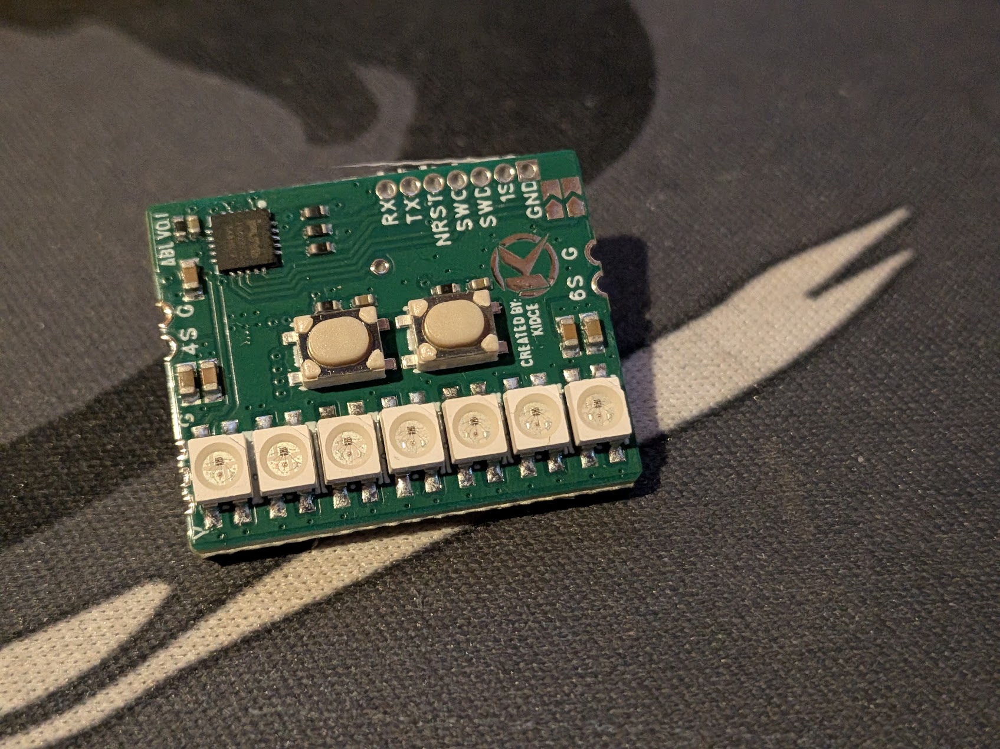
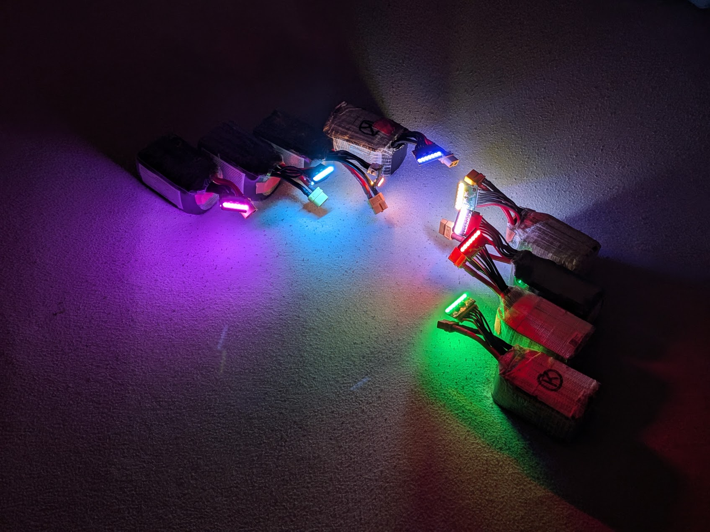
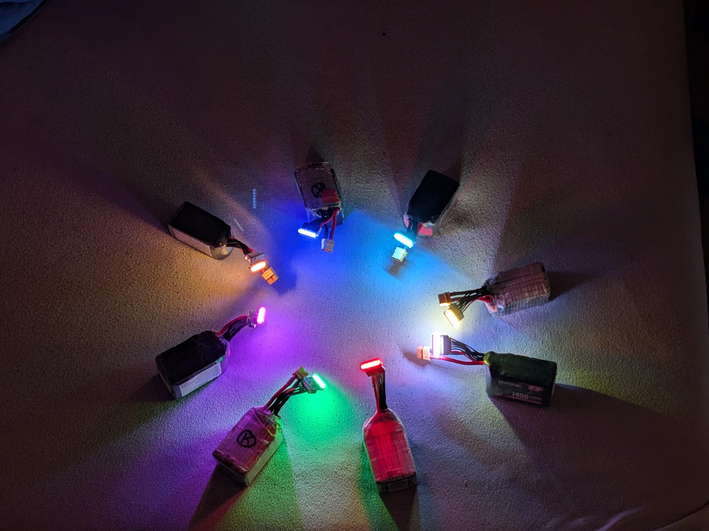

# Addressable Balancer LEDs

Addressable Balancer LED is a compact PY32F002B-based electronics and firmware project for FPV lighting and battery-status indication. It is more than a simple LED strip: the board combines mirrored addressable lighting, battery monitoring, selectable color profiles, and low-power operating modes in a small FPV-oriented controller.

[View the project on GitHub](https://github.com/KidCe/adressable-balancer-led){ .md-button .md-button--primary }

## What the project does

- Drives 14 onboard WS2812-compatible LEDs as mirrored 7+7 lighting.
- Provides eight color profiles, including common FPV race-channel colors.
- Shows a calibrated startup battery bar and low/critical-voltage warnings.
- Remembers the selected color and supports battery-checker and armed-standby modes.
- Locks the buttons after inactivity so vibration cannot change the setting in flight.
- Can continue the data pattern to an external addressable LED chain, with output support for up to 64 LED positions.

## Hardware and development

The controller uses a Puya PY32F002Bx5 Cortex-M0+ MCU, measures supply voltage through the ADC and internal reference, and is programmed through a small SWD pogo-pin connector. The current firmware release is `v1.1.0`.

The board is designed around a single-cell (1S) LiPo supply for the LED section. External LEDs need a correctly sized supply and a shared ground; do not connect the controller directly to a multi-cell battery without following the project's documented wiring and power design. Some shipped PCB revisions have only one working button, but the firmware keeps the main features accessible from that button.

The repository contains the firmware, Keil project, release scripts, wiring-related documentation, and an interactive user guide. Hardware verification should still be completed on the intended PCB revision before distributing binaries broadly.

## Gallery

These photos show the controller board and the lighting setups used while testing the project.

  <figure>
    
    <figcaption><strong>Controller board overview</strong> The compact board with its mirrored LED layout, control buttons and programming pads.</figcaption>
  </figure>

  <figure>
    
    <figcaption><strong>Board close-up</strong> PY32F002B controller, buttons, LED row and exposed test pads in detail.</figcaption>
  </figure>

  <figure>
    
    <figcaption><strong>Lighting test</strong> A practical test setup showing the controller driving illuminated LED modules from battery packs.</figcaption>
  </figure>

  <figure>
    
    <figcaption><strong>Multiple setups</strong> Several battery and LED combinations used to check the different colors and indication modes.</figcaption>
  </figure>

- [Read the interactive user guide](https://kidce.github.io/adressable-balancer-led/USER_GUIDE.html)
- [View the project on GitHub](https://github.com/KidCe/adressable-balancer-led)
