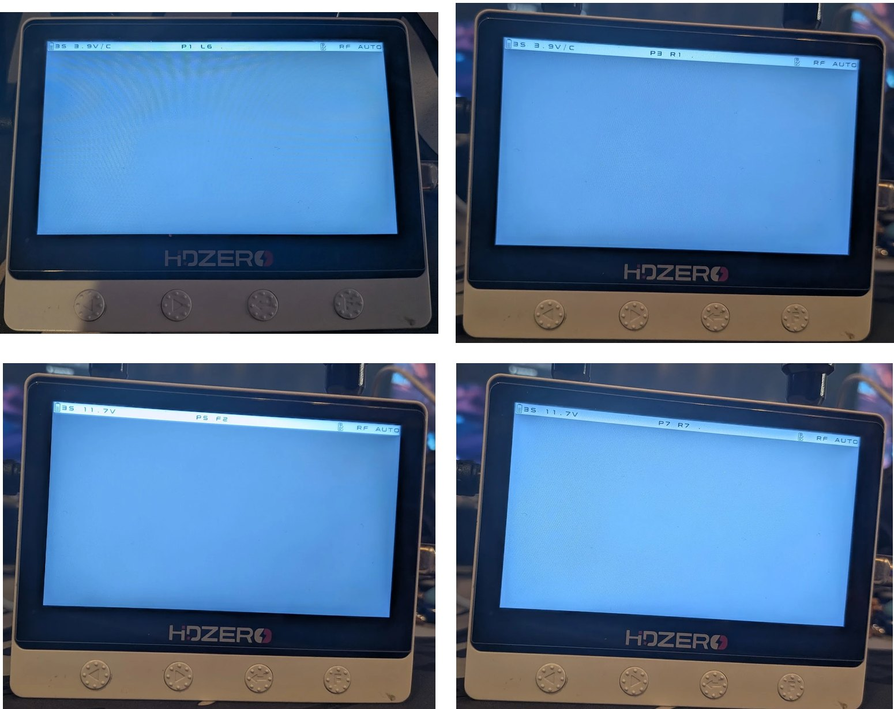

---
article:
  published: 2026-10-10
  summary: Unofficial HDZero Monitor firmware adding eight race-channel favorites, matching scan coverage and a shorter scan trigger.
  image: assets/media/projects/hdzero-monitor-favorites/favorites-on-device.jpg
  image_alt: HDZero Monitor showing Favorites slots P1 L6, P3 R1, P5 F2 and P7 R7
---

# HDZero Monitor Favorites

*The Favorites band on the development Monitor. No transmitter was powered for these photos, so the labels show the searching indicator.*

HDZero Monitor Favorites is an unofficial modification of the Monitor's **1.1.1 receiver firmware**. It groups eight race channels into a new **P band**, includes them in the built-in scan and reduces the hold time needed to start scanning. The community release identifies its receiver as **V1.1.2**; this is the project's version number.

[Project and source code](https://github.com/KidCe/hdzero-monitor-favorites) · [Download v1.1.2 Favorites](https://github.com/KidCe/hdzero-monitor-favorites/releases/tag/v1.1.2-favorites)

## Favorites and scan

The eight slots follow the channel set described in the project as used by Aircrasher race management:

| Slot | P1 | P2 | P3 | P4 | P5 | P6 | P7 | P8 |
|---|---|---|---|---|---|---|---|---|
| Channel | L6 | L7 | R1 | R2 | F2 | F4 | R7 | R8 |

The P band follows the six stock bands. Normal channel buttons step through its slots, while the status bar shows both slot and actual channel, for example `P1 L6 HDZ` or `P1 L6 ANA`.

Scanning covers **R1–R8, F2, L6, L7 and F4**. A scan started in P begins at the current slot and maps a found favorite back to its P slot. If it finds R3–R6, it selects the stock R band because those channels are not favorites. **E1 and F1 are no longer scanned**, including when scanning from a stock band.

The scan-start long press is reduced from approximately three seconds to **1.5 seconds**, on both buttons and in every band. The favorites list is fixed at build time.

## Installation and return to stock

**Tested by one person at home on one HDZero Monitor, PCB 1R3.** Neither the firmware nor the installer has been tested on another person's Monitor. This is unofficial firmware, unaffiliated with HDZero; use it at your own risk.

The project recommends the **`HDZero-Monitor-Favorites-v1.1.2.zip`** package. It requires Windows, 64-bit Python 3.11 or newer and the WCH CH341 driver installed with the HDZero Programmer. Close the programmer and connect only the Monitor by USB.

1. Extract the package and run **`1-check.cmd`**. This checks compatibility without writing.
2. If the check passes, run **`2-install.cmd`**, type `INSTALL`, wait for completion and power-cycle the Monitor.
3. To restore the official **1.1.1 receiver**, run **`3-uninstall.cmd`** and type `UNINSTALL`.

The installer checks pinned input files, the USB device, flash identities, FPGA/MStar firmware prefixes and two full receiver reads. It accepts official 1.1.1 or known Favorites receiver builds; unrecognized states are refused. Official 1.2.0 requires an explicit override and loses its receiver changes when replaced.

Only the receiver flash is written. The installer retains a backup and log and verifies the result with page checks and two full readbacks. Follow the [repository's installation and recovery instructions](https://github.com/KidCe/hdzero-monitor-favorites#install) for the current details.

An alternative update file exists for the official HDZero Programmer. **That installation path was not tested by the project authors** and lacks the installer's compatibility checks. It rewrites all three firmware parts without readback and restores the MStar part to official 1.1.1.

## How it works

The Monitor contains an MStar display/UI processor, a Gowin FPGA and a DM5680 receiver with an 8051 core. The modification targets the receiver code responsible for channel selection, tuning, buttons, scanning and status text.

Reverse engineering recovered the channel tables and relevant routines from the official binary. Small patches and approximately 550 appended bytes add the Favorites IDs and map them to the existing channels. A hand-encoded generator and a rebuild from recovered assembly produce matching images.

[Firmware internals](https://github.com/KidCe/hdzero-monitor-favorites/blob/main/docs/firmware-internals.md) · [Development history](https://github.com/KidCe/hdzero-monitor-favorites/blob/main/docs/project-history.md)

## Verification and limitations

On the development Monitor, the project reports working pictures on all eight favorites, correct labels, scanning from P and stock bands, the shorter scan trigger and normal boot after flashing. Receiver-only writes were read back, and restoring stock followed by re-flashing was verified.

The generalized installer passed simulated-flash tests and read-only checks/dry runs on that Monitor. This does not establish successful installation on other units. Other hardware revisions, recovery after an interrupted write, favorite persistence across power cycles, DVR interaction and all mode transitions remain unverified.

An official firmware update replaces the modification. A port to official 1.2.0 and faster channel switching are planned.

Original project work is MIT-licensed; official firmware and derived parts have separate [rights and provenance notes](https://github.com/KidCe/hdzero-monitor-favorites/blob/main/NOTICE.md). The project was developed with substantial assistance from OpenAI Codex and Anthropic Claude under the owner's direction. This article was prepared with OpenAI Codex.

