---
article:
  published: 2026-10-02
title: Tinywhoop LED Gate
hide:
  - toc
description: Three modular LED-gate concepts, from tested U profiles to a V-profile study and a planned 15 x 15 x 1 mm square-tube frame.
---

# Tinywhoop LED Gate

A modular racing gate with aluminum rails, 3D-printed connectors and segmented diffusers. The aim is a stable frame that is easy to assemble and visible from several directions.

**Project status · 4 October 2026.** U-profile prototypes have been tested. The V-profile and square-tube versions are untested concepts. All images below are CAD views, not photographs or proof of physical performance.

**Planned lighting:** WS2812 strips with 60 LEDs per meter, giving a 16.67 mm center spacing. The CAD views show 5 × 5 mm 5050 housings; 10 mm PCB width, 0.4 mm PCB thickness and roughly 1.6 mm housing height are illustrative until the actual strip is selected. [WS2812 family, Worldsemi](https://www.world-semi.com/products/ws2812b-v6.html).

| Concept | Status | Main finding / next question |
| --- | --- | --- |
| U-profile LED rail | Tested; not pursued further | Too easy to twist, including the inward-facing variant |
| V-profile LED rail | CAD concept; physical test pending | Test stiffness, retention and diffuser visibility from behind |
| 15 × 15 × 1 mm square tube | Preferred next experiment | Test the closed-section frame, then develop connectors and a diffuser |

1 · U-profile prototypes — tested, insufficient stiffness

The original prototype used shallow U-profile LED rails with the LEDs facing the incoming drone. During the project owner's physical assembly tests, the rails twisted easily and the gate did not stand sufficiently rigidly.

A second prototype rotated the U profile by 90°, placing the LEDs toward the gate opening. The owner reported some improvement in the assembled frame, but it was still too flexible. Rotation changes the bending orientation; it does not increase the rail's intrinsic torsional rigidity.

U-shaped profiles remain useful LED carriers, but this section was not satisfactory as the structural rail for this gate.

<figure>
<a href="../../assets/media/projects/tinywhoop-led-gate/concept-evolution/u-led-detail.png">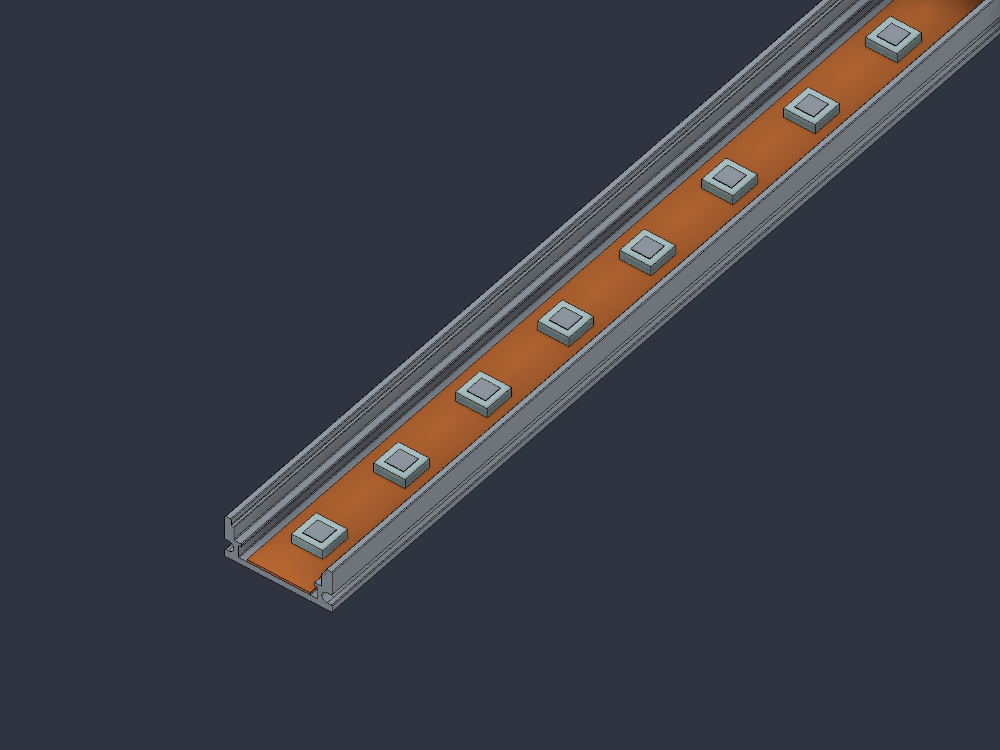</a>
<figcaption><strong>LED strip inside the U rail</strong>Thin PCB and 5050 packages on the original LED bed; 16.67 mm spacing represents 60 LEDs per meter.</figcaption>
</figure>
<figure>

<figcaption><strong>Original U profile</strong>An open, shallow section carries the LED strip.</figcaption>
</figure>
<figure>

<figcaption><strong>Original gate layout</strong>Printed connectors, segmented diffusers and four offcut feet. CAD illustration of the tested concept.</figcaption>
</figure>
<figure>
<a href="../../assets/media/projects/tinywhoop-led-gate/concept-evolution/u-inward-profile.png">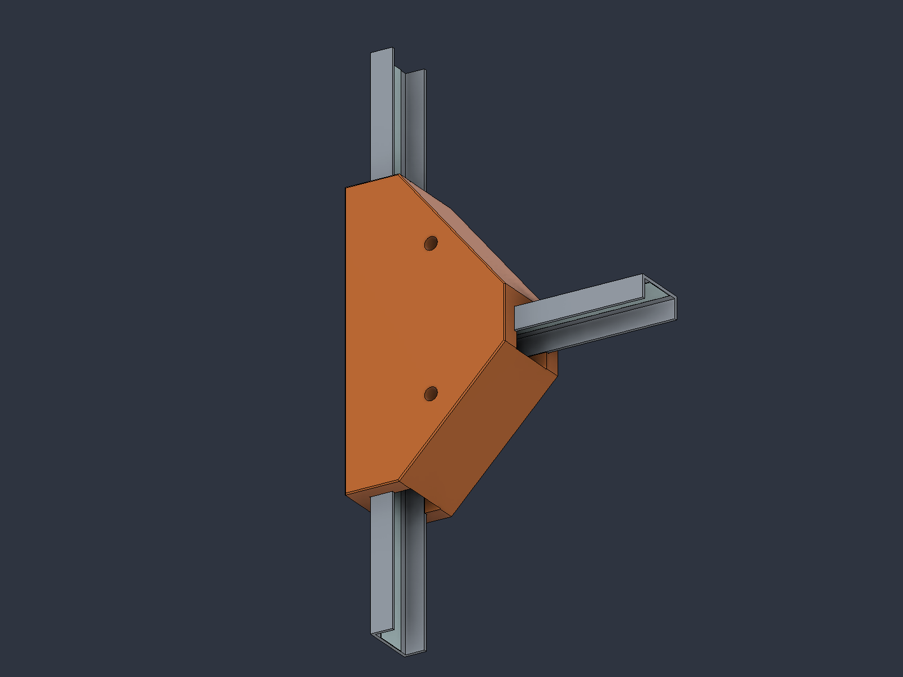</a>
<figcaption><strong>U profile rotated by 90°</strong>The LEDs face the opening. This variant was also built and tested.</figcaption>
</figure>
<figure>
<a href="../../assets/media/projects/tinywhoop-led-gate/concept-evolution/u-inward-gate.png">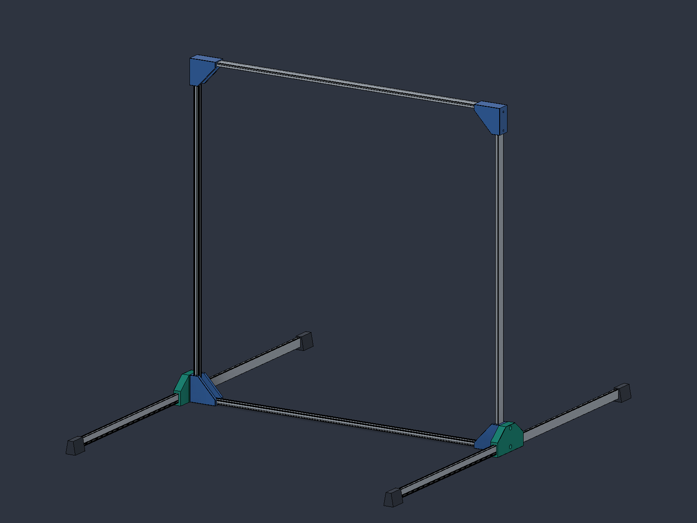</a>
<figcaption><strong>Inward-facing U-profile frame</strong>CAD layout with dedicated foot brackets. The physical prototype remained too flexible.</figcaption>
</figure>

Original U-profile CAD assembly gallery · archive

These images document the earlier connector and foot arrangement. They are retained as design history; they are not a current build recommendation.

### Aluminum profile

LED aluminum profile, based visually on the [Jopassy U profile](https://www.kaufland.de/product/443322053/). The modeled contour is approximate.

  <figure>
    
    <figcaption><strong>Profile section</strong> Rounded clip channels outside; support ledges and stepped walls inside.</figcaption>
  </figure>

  <figure>
    
    <figcaption><strong>Short profile sample</strong> The LED strip sits on the aluminum floor.</figcaption>
  </figure>

### Printed 90° connector · blue

  <figure>
    
    <figcaption><strong>90° connector</strong> Two perpendicular sockets form a frame corner.</figcaption>
  </figure>

  <figure>
    
    <figcaption><strong>Profile sockets</strong> The aluminum sections slide into the printed connector.</figcaption>
  </figure>

  <figure>
    
    <figcaption><strong>Rear and mounting holes</strong> Holes provide attachment points for M3 heat-set inserts.</figcaption>
  </figure>

### Printed T connector · orange

  <figure>
    
    <figcaption><strong>T connector</strong> The same three-way part serves as a foot holder or frame junction.</figcaption>
  </figure>

  <figure>
    
    <figcaption><strong>Open center</strong> The central passage leaves room for cable routing.</figcaption>
  </figure>

  <figure>
    
    <figcaption><strong>Mounting face</strong> Two upper holes align with the corner connector.</figcaption>
  </figure>

### 1 · Build the frame

  <figure>
    
    <figcaption><strong>Insert the profiles</strong> Push both aluminum sections into the corner sockets.</figcaption>
  </figure>

  <figure>
    
    <figcaption><strong>One assembled corner</strong> The profiles meet at the printed connector.</figcaption>
  </figure>

  <figure>
    
    <figcaption><strong>Four corners, four profiles</strong> Arrange the frame parts before closing the square.</figcaption>
  </figure>

  <figure>
    
    <figcaption><strong>Closed frame</strong> Four 600 mm sections form one gate.</figcaption>
  </figure>

### 2 · Add the feet

Each 1 m profile supplies a 600 mm gate bar and a roughly 400 mm foot offcut. The feet stand on edge for stiffness.

  <figure>
    
    <figcaption><strong>Attach the foot holder</strong> Bolt the T connector onto the outside of the lower corner.</figcaption>
  </figure>

  <figure>
    
    <figcaption><strong>Two M3 screws</strong> Two upper screws and washers hold the T connector.</figcaption>
  </figure>

  <figure>
    
    <figcaption><strong>Insert the feet</strong> One 400 mm offcut extends forward, the other backward.</figcaption>
  </figure>

  <figure>
    
    <figcaption><strong>Four feet</strong> Both sides reuse the same T connector component.</figcaption>
  </figure>

### 3 · Clip on the diffusers

  <figure>
    
    <figcaption><strong>Add the diffusers</strong> The segmented covers approach the frame from the front.</figcaption>
  </figure>

  <figure>
    
    <figcaption><strong>Clip-on detail</strong> A printed diffuser segment clips over the aluminum profile.</figcaption>
  </figure>

  <figure>
    
    <figcaption><strong>Bottom bar covered</strong> Three approximately 200 mm segments cover one bar.</figcaption>
  </figure>

### 4 · Fit the foot caps

  <figure>
    
    <figcaption><strong>Foot end cap</strong> A full-surround trapezoid cap provides a wider ground contact at each foot end.</figcaption>
  </figure>

### The complete gate

  <figure>
    
    <figcaption><strong>Incoming-drone view</strong> The LED-facing side points toward the approaching drone.</figcaption>
  </figure>

  <figure>
    
    <figcaption><strong>Complete gate</strong> A square illuminated frame with forward and rear supports.</figcaption>
  </figure>

  <figure>
    
    <figcaption><strong>Rear view</strong> The aluminum frame remains visible behind the diffusers.</figcaption>
  </figure>

  <figure>
    
    <figcaption><strong>Foot layout</strong> The top view shows the four opposing support sections.</figcaption>
  </figure>

### Extension · Double gate

The T connector also links two stacked frames. Diffuser details at the shared junction still need refinement.

  <figure>
    
    <figcaption><strong>Stacked frame</strong> Two T junctions replace the upper corners at the shared bar.</figcaption>
  </figure>

  <figure>
    
    <figcaption><strong>Shared T junction</strong> Upper and lower uprights meet the horizontal crossbar.</figcaption>
  </figure>

  <figure>
    
    <figcaption><strong>Double-gate concept</strong> Two gates share one horizontal bar and the same foot system.</figcaption>
  </figure>

2 · V-profile concept — awaiting a physical test

The [Jopassy V-profile rail](https://www.kaufland.de/product/443322038/) adds a closed triangular chamber below the LED bed. The hope is greater torsional rigidity than the shallow open U rail; the complete gate still needs a physical test.

Printed 90° and T junctions use solid blocks with profile sockets, end stops and retaining lips. Their central LED support remains flat. The aluminum rim geometry is estimated from the listing's 16 mm flank dimension and is adjustable in Fusion; the dimensions are not yet verified against the delivered rail.

**Main challenge: the diffuser.** The wide metal section obscures the cover from behind. A printed cover must extend beyond the profile's silhouette to expose illuminated shoulders. The revised 0.8 mm cover wraps around the F-shaped rims and widens into a balloon chamber. Wrap depth, clearance and chamber dimensions are adjustable in Fusion; rear glow, printability and clip fit remain untested.

<figure>
<a href="../../assets/media/projects/tinywhoop-led-gate/concept-evolution/v-led-detail.png">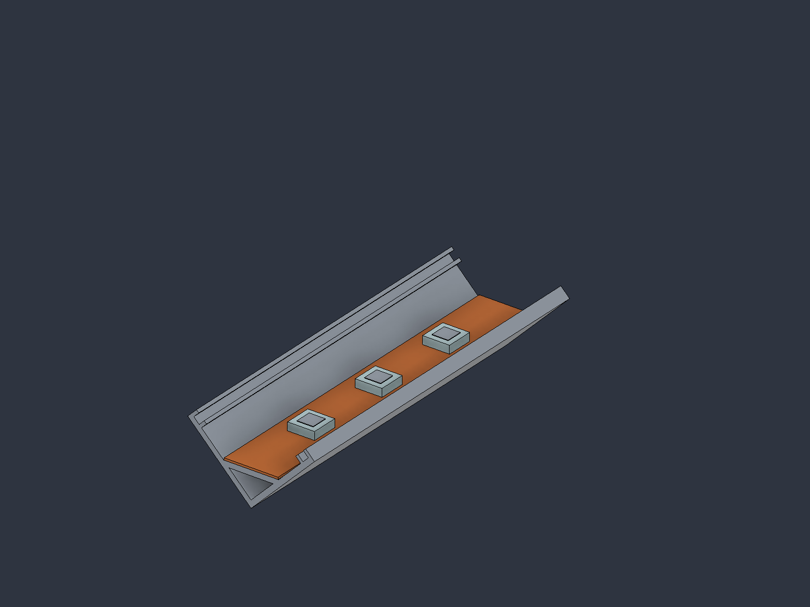</a>
<figcaption><strong>LED strip on the V-profile bed</strong>The strip lies on the flat LED support above the closed triangular cell. Packages remain below the upper clip rims.</figcaption>
</figure>
<figure>
<a href="../../assets/media/projects/tinywhoop-led-gate/concept-evolution/v-retained-section.png">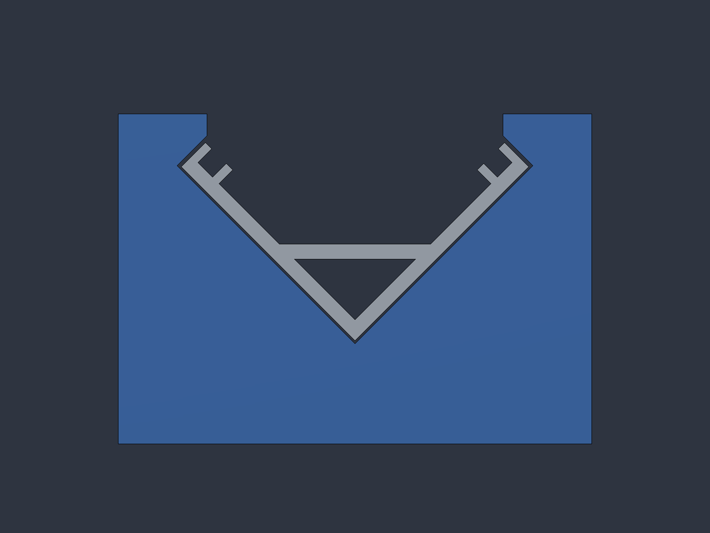</a>
<figcaption><strong>V-profile retention</strong>Continuous F-shaped rims sit beneath the matched retaining lips. Final fit awaits the real extrusion.</figcaption>
</figure>
<figure>
<a href="../../assets/media/projects/tinywhoop-led-gate/concept-evolution/v-retained-corner.png">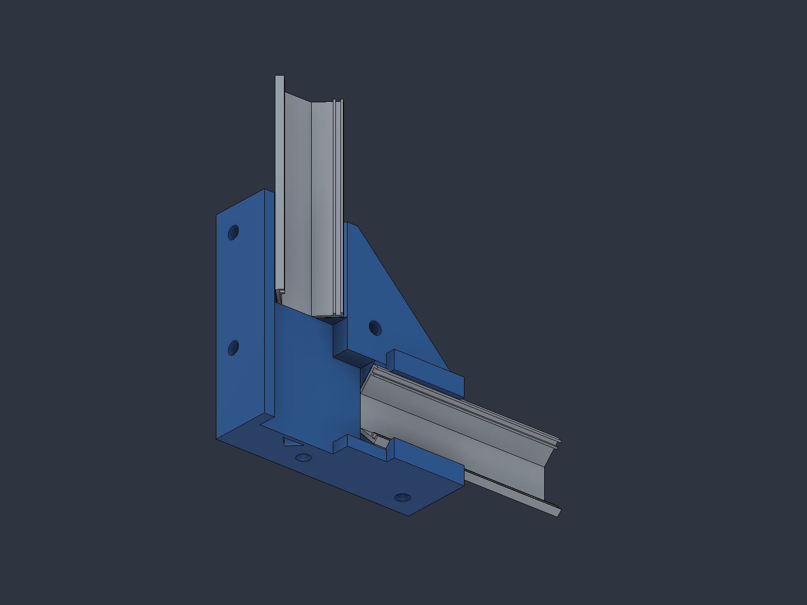</a>
<figcaption><strong>Profiles in the corner</strong>Axial insertion under the retaining lips; a solid junction continues the flat LED support.</figcaption>
</figure>
<figure>
<a href="../../assets/media/projects/tinywhoop-led-gate/concept-evolution/v-tee.png">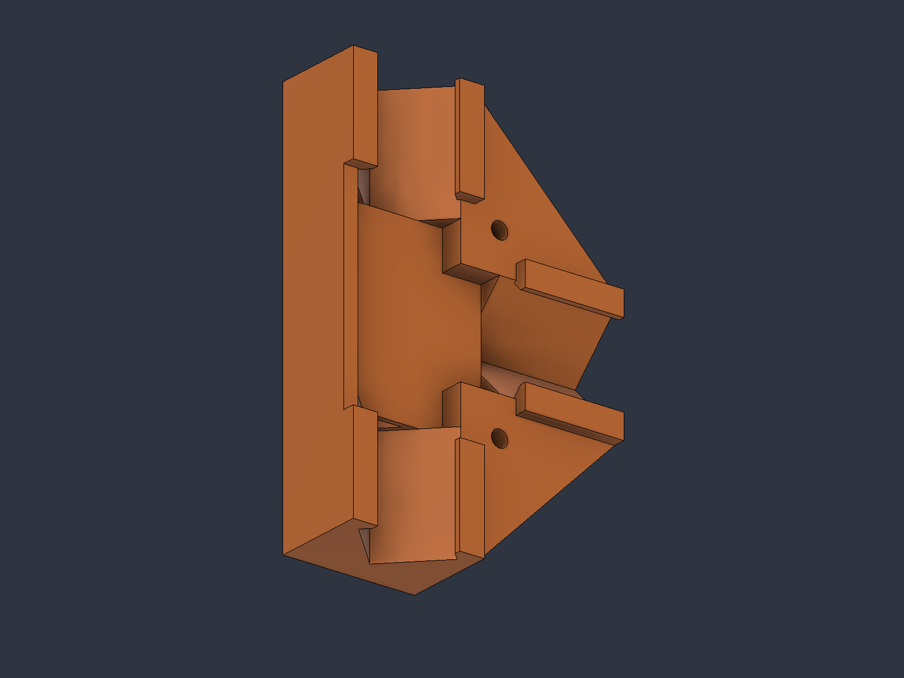</a>
<figcaption><strong>Three-way junction</strong>The T connector provides the shared crossbar junction for stacked gates.</figcaption>
</figure>
<figure>
<a href="../../assets/media/projects/tinywhoop-led-gate/concept-evolution/v-diffuser-section.png">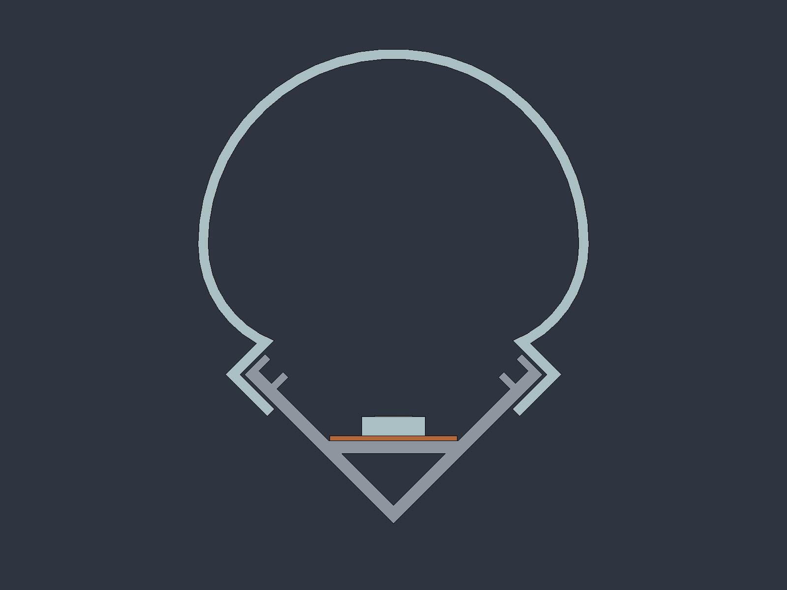</a>
<figcaption><strong>Diffuser cross-section</strong>The 0.8 mm balloon wall wraps around both outer F-rim corners. Clip retention and rear glow need physical tests.</figcaption>
</figure>
<figure>
<a href="../../assets/media/projects/tinywhoop-led-gate/concept-evolution/v-diffuser-oblique.png">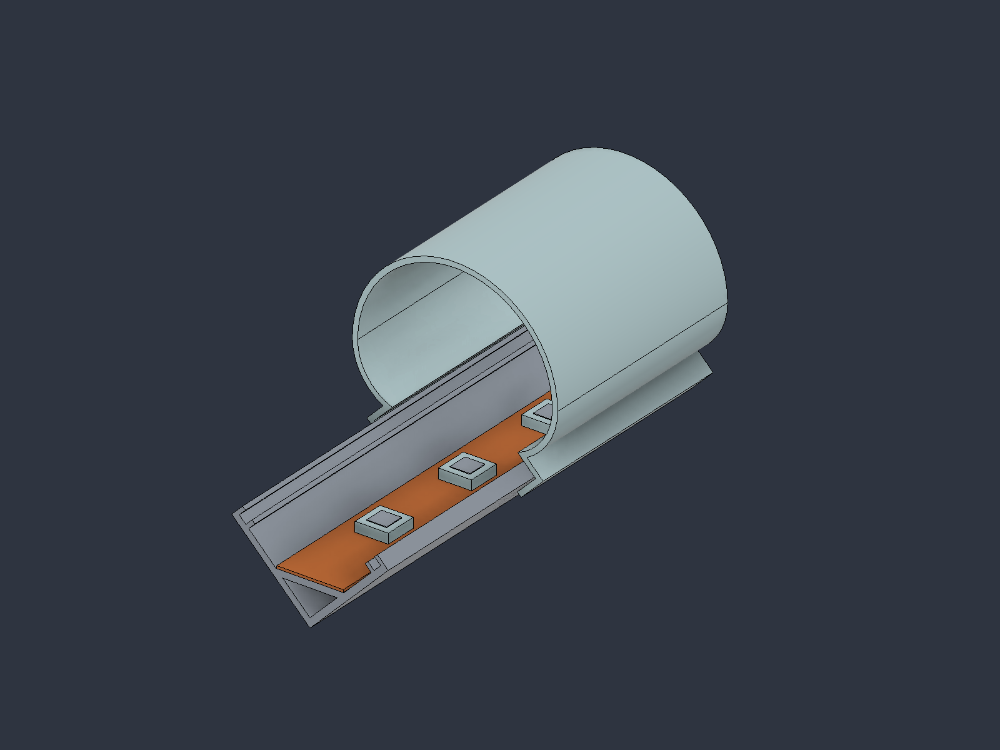</a>
<figcaption><strong>Diffuser over the V profile</strong>A continuous extruded section returns along the outside flanks, with 0.25 mm nominal clearance around the rims.</figcaption>
</figure>
<figure>
<a href="../../assets/media/projects/tinywhoop-led-gate/concept-evolution/v-frame-layout.png">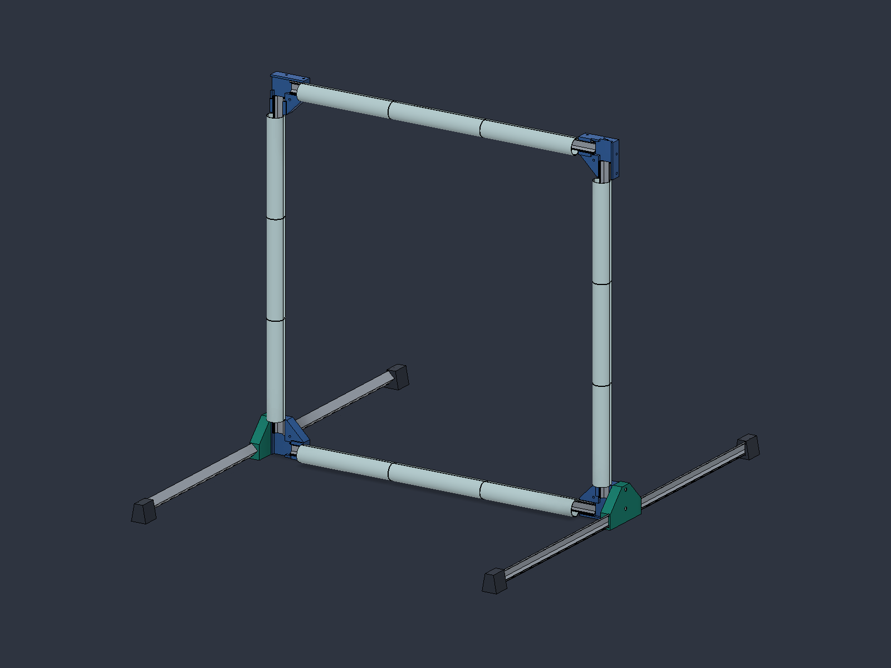</a>
<figcaption><strong>V-profile gate layout</strong>Assembly overview with four feet; mechanical stability has not yet been tested.</figcaption>
</figure>

3 · Square-tube concept — preferred next experiment

Use a **closed aluminum tube, 15 × 15 mm outside with a 1 mm wall**, as the structural rail. The LED strip can adhere to a flat outer face; a separate printed diffuser provides the light shape.

A continuous closed section is expected to resist twisting much better than the shallow open U section at comparable dimensions. That makes it the preferred next experiment, rather than a validated final solution. Printed connector stiffness and clearance can still determine how rigid the assembled gate feels. [Background: torsion of closed sections, MIT](https://ocw.mit.edu/courses/16-20-structural-mechanics-fall-2002/resources/unit12/).

The starting layout remains four roughly 600 mm frame rails and four roughly 400 mm offcut feet from meter lengths, allowing for saw kerf.

**Wraparound diffuser:** the project owner's new section combines a 20 mm round light chamber with side arms and hooks behind the tube. The 0.8 mm optical wall is retained. It widens beyond the 15 mm tube to leave plastic visible around the metal silhouette; rear illumination remains to be tested.

The refinement adds **0.15 mm clearance per tube face** and **0.4 mm entry ramps** to a **180 mm module**. Both rear hooks remain continuous: one 2D section is extruded along the whole module, with no intermediate steps for upright printing. Length, clearance and ramp depth are editable in Fusion; the section stays linked to the owner's original diffuser. These are starting values for a print trial, not proven fit tolerances.

**Next test:** print the separate 20 mm fit coupon and check installation force, retention and removal on the real tube. Then test a full module for rear glow and layer strength. Corner interfaces and the complete square-tube gate remain to be developed.

<figure>
<a href="../../assets/media/projects/tinywhoop-led-gate/concept-evolution/square-clip-section.png">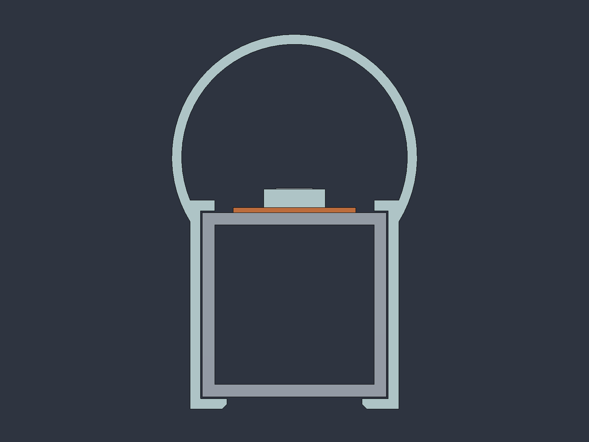</a>
<figcaption><strong>Wraparound clip section</strong>The owner-designed 20 mm round light chamber sits in front of the 15 mm tube. Continuous rear hooks retain the cover; orange marks the LED-strip PCB.</figcaption>
</figure>
<figure>
<a href="../../assets/media/projects/tinywhoop-led-gate/concept-evolution/square-clip-assembled.png">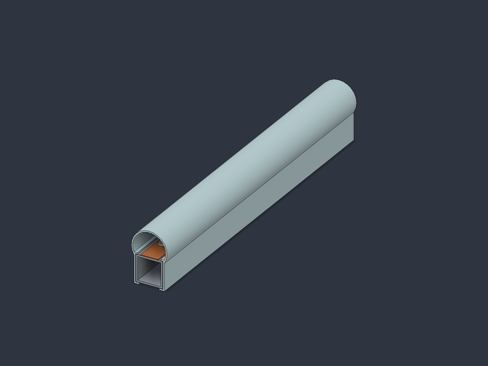</a>
<figcaption><strong>Continuous light surface</strong>A 180 mm module retains the original 0.8 mm optical wall. The cover widens beyond the tube, while its arms reach around the sides.</figcaption>
</figure>
<figure>
<a href="../../assets/media/projects/tinywhoop-led-gate/concept-evolution/square-clip-rear-hooks.png">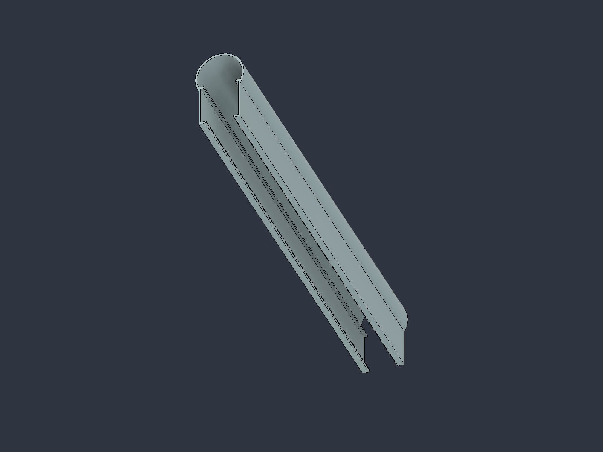</a>
<figcaption><strong>Continuous retaining edges</strong>The rear hooks run the full module length. The same 2D section is extruded throughout, avoiding intermediate steps when printed upright.</figcaption>
</figure>
<figure>
<a href="../../assets/media/projects/tinywhoop-led-gate/concept-evolution/square-clip-rear-assembled.png">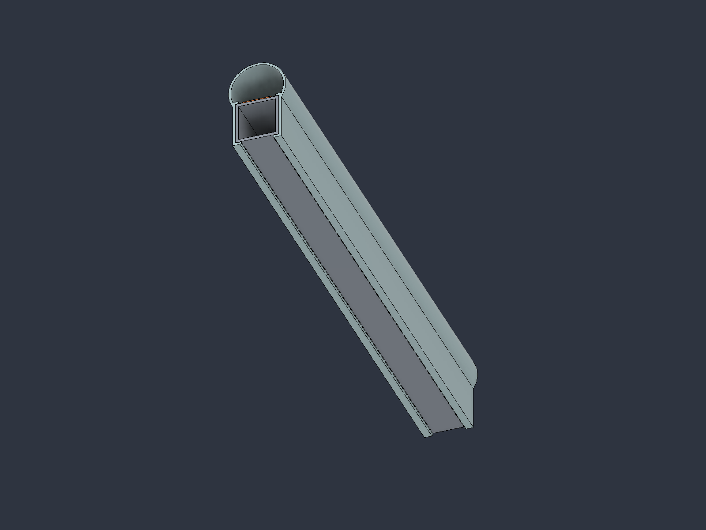</a>
<figcaption><strong>Retained behind the tube</strong>The rear hooks overlap the tube edges. Wider illuminated shoulders may remain visible from behind; actual glow and snap performance still need a physical test.</figcaption>
</figure>
<figure>
<a href="../../assets/media/projects/tinywhoop-led-gate/concept-evolution/square-led-strip.png">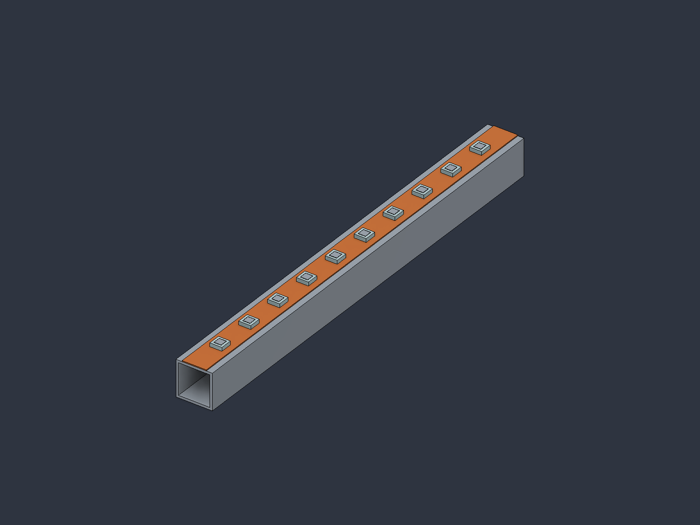</a>
<figcaption><strong>WS2812 strip on a flat face</strong>5050 housings and optical windows are shown at 16.67 mm pitch for 60 LEDs per meter. PCB dimensions and package height are illustrative.</figcaption>
</figure>

The square-tube diffuser base section was designed by the project owner. CAD refinements and documentation were prepared with substantial OpenAI Codex assistance under owner direction. Physical prototype observations are reported by the project owner; dimensions, fit and lighting of the unbuilt concepts remain provisional.

