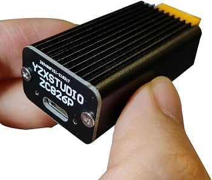
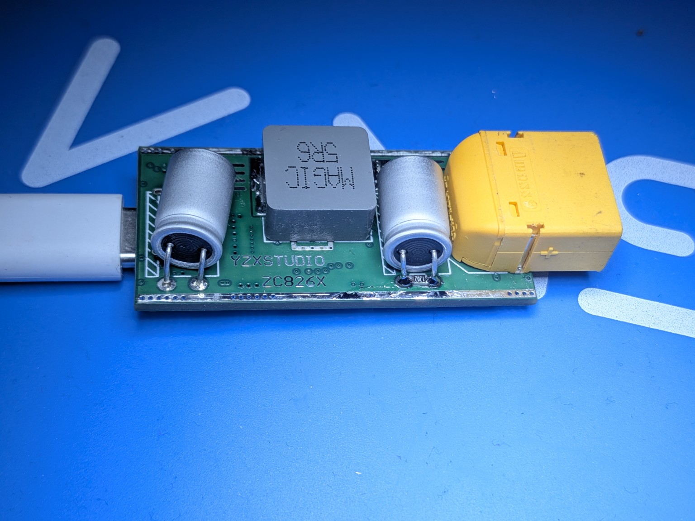

# IP2368 USB-C PD module appears dead after reconnecting

**Module:** AliExpress 100 W bidirectional buck-boost board with IP2368 and XT60 battery input.

*Product listing image supplied for identification; the repair photo below shows the exposed board.*

## Symptoms

- After disconnecting and reconnecting the battery, the module may not start and appears defective.
- A retry several minutes later may still fail; after a much longer wait, it can start again.
- No visible damage or unusual heating was found.

## Diagnosis and attempted fix

During bench testing with quick reconnections, a **blue LED blinked three times** before the module stopped responding. This *may* be related to undervoltage protection, but the meaning of the blink pattern has not been confirmed.

Voltage remained on the input capacitors after disconnecting the battery. A **10 kΩ bleed resistor** was soldered across the input capacitor bank near the XT60 to discharge it after unplugging. Confirm the connection points are across XT60+ and XT60− before making this modification.

*Reverse side of the board with the added resistor beside the XT60.*

## Initial result

- The three blue blinks occurred again during bench testing.
- The capacitor voltage then fell on the multimeter, and the module started afterward.
- **Promising bench result; not yet a confirmed long-term fix.**

With approximately **330 µF** of input capacitance, 10 kΩ takes about **11 seconds** to discharge from **25.2 V to 1 V** (ideal RC estimate). The resistor draws about **2.5 mA continuously** while a fully charged 6S battery remains connected. Check the resistor's continuous power rating; dissipation at 25.2 V is approximately **64 mW**.
